# WAD - Web Application Document - Módulo 2 - Inteli


## 🐶DataDogs

#### Nomes dos integrantes do grupo

- <a href="https://www.linkedin.com/in/arthur-bretas-b2a6a82b9/">Arthur Bretas Oliveira</a>
- <a href="https://www.linkedin.com/in/danielaraujogon%C3%A7alves/">Daniel Augusto de Araújo Gonçalves</a>
- <a href="https://www.linkedin.com/in/joao-guilherme-salomao/">João Guilherme de Jesus Salomão</a>
- <a href="https://www.linkedin.com/in/larissa-temoteo-641669302/">Larissa dos Santos Temoteo</a>
- <a href="https://www.linkedin.com/in/marcoruas/">Marco Ruas Sales Peixoto</a>
- <a href="https://www.linkedin.com/in/murilo-couto-oliveira/">Murilo Couto Oliveira</a>
- <a href="https://www.linkedin.com/in/rafael-furtado-b30715265/">Rafael Furtado Victor dos Santos</a>


## Sumário

[1. Introdução](#c1)

[2. Visão Geral da Aplicação Web](#c2)

[3. Projeto Técnico da Aplicação Web](#c3)

[4. Desenvolvimento da Aplicação Web](#c4)

[5. Testes da Aplicação Web](#c5)

[6. Conclusões e trabalhos futuros](#c6)

[7. Referências](#c7)

[Anexos](#c8)

<br>


# <a name="c1"></a>1. Introdução

&nbsp;&nbsp;&nbsp;&nbsp;&nbsp;&nbsp;O INSPA, Instituto de Saúde e Psicologia Animal, é uma instituição pioneira idealizada pela Prof. Dra. Ceres Berger Faraco em 2011. Sua história é marcada pelo compromisso com o bem-estar animal e a interação humano-animal, preenchendo uma lacuna na área da educação brasileira. Desde sua fundação, o INSPA tem sido um catalisador de avanços, oferecendo cursos e programas de pós-graduação inovadores que abordam o comportamento e o bem-estar de cães e gatos <a href="#INSPA">(Comportamento [...], 2024)</a> , além de ter contribuído significativamente para a consolidação de conceitos como psicofarmacologia veterinária e a expressão "família multiespécie".

&nbsp;&nbsp;&nbsp;&nbsp;&nbsp;&nbsp;Em consonância com a trajetória e inovação da instituição, o projeto proposto pelo INSPA visa desenvolver uma aplicação web responsiva que colete e consolide dados sobre os critérios de adoção, compra e abandono de cães e gatos. Nesse sentido, o abandono de cães e gatos é um fenômeno complexo, influenciado por uma série de fatores que vão desde aspectos comportamentais dos tutores até questões socioculturais mais amplas. No entanto, a falta de uma base de dados ampla, confiável e organizada sobre esse comportamento dificulta significativamente os esforços para compreender suas causas e, consequentemente, desenvolver estratégias eficazes para reduzi-lo. Dessa forma, visando uma amplitude maior acerca dos fatores que acarretam diferentes fenômenos relacionais, mais específico na adoção, na venda e no abandono de cães e gatos, a solução desenvolvida servirá como uma base esclarecedora.


# <a name="c2"></a>2. Visão Geral da Aplicação Web

## 2.1. Escopo do Projeto

### 2.1.1. Contexto da indústria


&nbsp;&nbsp;&nbsp;&nbsp; O Instituto de Saúde e Psicologia Animal, hoje conhecido como INSPA, é uma empresa que tem como missão educar a sociedade por meio de cursos  e programas de pós graduação, assim, eles desenvolveram um ensino continuado de comportamento e bem-estar animal com direito a atuação direta na produção do primeiro livro nacional sobre os Fundamentos do Comportamento Canino e Felino. Além disso, a empresa possui um carácter social, contribuindo na área onde atua, com a criação da expressão "família multiespécie".

&nbsp;&nbsp;&nbsp;&nbsp; O Instituto surgiu com a missão de promover o bem-estar dos seres vivos e das comunidades em que estão inseridos, como uma pioneira na área de educação brasileira, foi responsável pelo lançamento da primeira pós-graduação sobre Psicofarmacologia Veterinária ensinando detalhadamente sobre tratamento de distúrbios comportamentais e psicológicos em animais de estimação. Desde o início, o Instituto revolucionário, já previa de alguma forma o poder da tecnologia digital e da educação a distância. Dessa maneira, o INSPA auxiliou a tornar um campo disciplinar, em um multidisciplinar, integrando diversas áreas de conhecimento e abordagens para promover uma compreensão mais abrangente (Figura 1).


<div align="center">
<sub>Figura 1 - Imagem INSPA</sub>

<sup>Fonte: Material produzido pelo INSPA</sup>
</div>

&nbsp;&nbsp;&nbsp;&nbsp; Idealizado em 2011 para preencher uma lacuna muito pouco aparente e comprometido em oferecer uma plataforma inovadora e referencial, a fundação se dedica à divulgação, à formação contínua, à implementação de estratégias, à aplicação e produção de conhecimento em comportamento animal, à saúde animal e à outros campos relacionados. Dessa forma, a empresa, através de seus cursos, partilha aprendizados sobre comportamento animal, assim, criando uma comunidade que compartilha entre si esses conhecimentos.

&nbsp;&nbsp;&nbsp;&nbsp; Considerando que o INSPA se estabeleceu em um espaço em branco no mercado, o Instituto não possui concorrentes diretos no seu local de atuação. Porém, vê-se necessário considerar que apesar de não ter “rivais” diretos, possui indiretos tais quais como Organizações não Governamentais, Faculdades e Institutos de Pesquisa. Nessa perspectiva, esses tipos de competidores indiretos existem pois, assim como o Instituto, existem outros campos de psicologia veterinária atuantes no presente, o que pode acarretar em uma competição pela mesma comunidade participante nesse meio.


&nbsp;&nbsp;&nbsp;&nbsp; Assim, ao compartilhar conhecimento e promover uma comunidade de aprendizado, o INSPA continua a desempenhar um papel crucial na formação de profissionais e na conscientização sobre questões relacionadas ao comportamento animal e à saúde animal. Seu compromisso com a inovação e a excelência educacional destaca sua relevância contínua e seu impacto positivo nas comunidades em que atua.


### 2.1.2. Modelo de 5 Forças de Porter
&nbsp;&nbsp;&nbsp;&nbsp;&nbsp;&nbsp;Em um mundo empresarial cada vez mais dinâmico e competitivo, compreender as forças que influenciam a atratividade e a lucratividade de um mercado é crucial para qualquer negócio. Desenvolvido por Michael E. Porter em 1979, o modelo das Cinco Forças é uma ferramenta estratégica que permite às empresas analisar a intensidade competitiva de um mercado <a href="#Porter">(Casarotto, 2020)</a> . Este modelo é fundamental não apenas para a formulação de estratégias, mas também para a tomada de decisões conscientes e embasadas que possam assegurar uma posição vantajosa no mercado.

&nbsp;&nbsp;&nbsp;&nbsp;&nbsp;&nbsp;O modelo das Cinco Forças de Porter examina cinco aspectos fundamentais do ambiente competitivo de uma empresa:

1. **Rivalidade entre os concorrentes existentes**: Este aspecto refere-se à intensidade da competição entre as empresas já estabelecidas no mercado. Uma alta rivalidade pode levar a guerras de preços, inovações constantes e campanhas de _marketing_ agressivas, como observado no documento em relação à indústria do INSPA. Empresas como a Apple, por exemplo, enfrentam forte concorrência em mercados de tecnologia avançada.

2. **Ameaça de novos entrantes**: Mercados lucrativos atraem novos participantes, o que pode diluir a quota de mercado das empresas existentes. Barreiras à entrada, como capital intensivo para desenvolvimento de material e contratação de especialistas podem influenciar essa força, sendo considerada alta a barreira de entrantes.

3. **Poder de barganha dos fornecedores**: Podem ser considerados fornecedores para esse setor pesquisadores e médicos veterinários altamente qualificados, os quais podem exercer poder sobre as empresas ao cobrar preços mais altos, o que afeta diretamente a lucratividade das empresas contratantes.

4. **Poder de barganha dos compradores**: Compradores fortes, especialmente aqueles que adquirem em grandes volumes, podem influenciar os preços e as condições de venda, exigindo qualidade superior e mais benefícios. Isso é comum em setores onde os produtos são padronizados e a troca entre fornecedores é relativamente simples e sem custo.

5. **Ameaça de produtos ou serviços substitutos**: A existência de produtos alternativos que podem atender às mesmas necessidades dos consumidores coloca uma pressão adicional sobre as empresas. Metodologias disruptivas, por exemplo, frequentemente introduzem substitutos que podem rapidamente obsoletizar produtos existentes.

&nbsp;&nbsp;&nbsp;&nbsp;&nbsp;&nbsp;A aplicação dessas cinco forças ajuda a empresa a identificar elementos-chave que afetam a competitividade e a planejar estratégias para abordar ou capitalizar sobre essas condições. Segundo o documento fornecido, análises setoriais detalhadas e relatórios acadêmicos são ferramentas úteis para embasar essa análise.

&nbsp;&nbsp;&nbsp;&nbsp;&nbsp;&nbsp;A análise das Cinco Forças de Porter é mais do que uma ferramenta de diagnóstico, é um quadro estratégico para entender a posição de uma empresa dentro de seu contexto de mercado. Empresas que efetivamente aplicam este modelo são capazes de antecipar mudanças, adaptar suas estratégias de maneira proativa e, consequentemente, manter ou alcançar uma vantagem competitiva. Para aqueles que estão apenas começando a explorar conceitos de estratégia empresarial, entender e aplicar as Cinco Forças de Porter pode revelar não apenas como competir mais eficazmente, mas também como perceber oportunidades onde outros veem obstáculos.

&nbsp;&nbsp;&nbsp;&nbsp;&nbsp;&nbsp;Assim, ao se realizar uma análise do mercado em que  o Instituto de Psicologia Animal está inserido, temos que (Figura 2):

<div align="center">
<sub>Figura 2 - 5 forças de porter do Instituto de Saúde e Psicologia Animal
</sub>
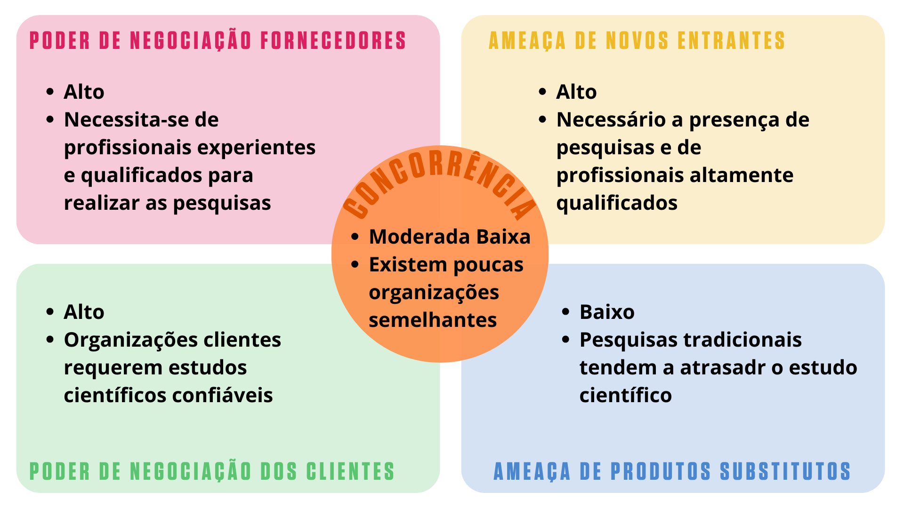
<sup>Fonte: Material produzido pelos autores (2024)</sup>
</div>

&nbsp;&nbsp;&nbsp;&nbsp;&nbsp;&nbsp;**Poder de Barganha dos Fornecedores**:
Neste mercado, os fornecedores incluem profissionais altamente qualificados (psicólogos, veterinários, pesquisadores), plataformas tecnológicas e financiadores de pesquisa. A qualidade e especialização dos profissionais são críticas, o que pode conferir a eles um poder de barganha considerável. Por outro lado, a tecnologia é um componente essencial, mas geralmente há várias opções disponíveis no mercado.

&nbsp;&nbsp;&nbsp;&nbsp;&nbsp;&nbsp;**Ameaça de produtos ou serviços substitutos**:
No mercado de psicologia animal, os substitutos para uma aplicação de coleta de dados podem incluir pesquisas tradicionais, análises comportamentais sem tecnologia e outras formas de estudos acadêmicos. A principal ameaça seria uma nova tecnologia ou metodologia que oferecesse insights mais rápidos, baratos ou detalhados sobre o comportamento humano-animal.

&nbsp;&nbsp;&nbsp;&nbsp;&nbsp;&nbsp;**Rivalidade entre os concorrentes existentes**:
No campo da psicologia animal, a rivalidade pode ser considerada moderada a baixa. Existem poucas instituições e organizações que combinam a pesquisa em psicologia animal com a coleta de dados em larga escala. Entretanto, universidades, institutos de pesquisa e organizações não-governamentais que trabalham com bem-estar animal podem ser considerados concorrentes indiretos.

&nbsp;&nbsp;&nbsp;&nbsp;&nbsp;&nbsp;**Ameaça de novos entrantes**:
A área de psicologia animal, especialmente aquela que lida com dados em larga escala sobre comportamento humano relacionado a animais, possui barreiras significativas de entrada. Isso inclui a necessidade de expertise especializada, acesso a redes de pesquisa e financiamento para projetos de longo prazo, o que pode desencorajar novos entrantes.

&nbsp;&nbsp;&nbsp;&nbsp;&nbsp;&nbsp;**Poder de barganha dos compradores**:
Os compradores, que podem ser instituições acadêmicas, organizações de bem-estar animal e agências governamentais, geralmente têm um poder de barganha significativo. Eles buscam resultados de pesquisa confiáveis e inovadores para basear políticas e práticas. A especificidade e a relevância dos dados coletados pela aplicação da INSPA podem, no entanto, aumentar sua influência sobre esses compradores.


### 2.1.3. Análise SWOT

&nbsp;&nbsp;&nbsp;&nbsp;&nbsp;&nbsp;A análise SWOT é uma ferramenta de gestão que possibilita identificar o cenário interno e externo dos negócios. A ferramenta serve para analisar tanto o que está sob controle da empresa, para determinar suas forças e fraquezas, quanto o que o gestor não tem controle,  para descobrir as oportunidades e ameaças <a href="#SWOT">(Aprenda [...], 2019)</a>.

&nbsp;&nbsp;&nbsp;&nbsp;&nbsp;&nbsp;Para o Instituto de Saúde e Psicologia Animal, uma boa análise SWOT fornece uma compreensão abrangente do ambiente interno e externo da instituição, com informações imprescindíveis para um bom planejamento estratégico e ajuda na tomada de decisões para permanecer como líder no mercado.

&nbsp;&nbsp;&nbsp;&nbsp;&nbsp;&nbsp;Considerando as concepções da Análise SWOT,  foi possível identificar as forças, as fraquezas, as oportunidades e as ameaças que contemplam o INSPA, conforme constam-se abaixo (Figura 3).

<div align="center">
<sub>Figura 3 - Análise SWOT do Instituto de Saúde e Psicologia Animal
</sub>
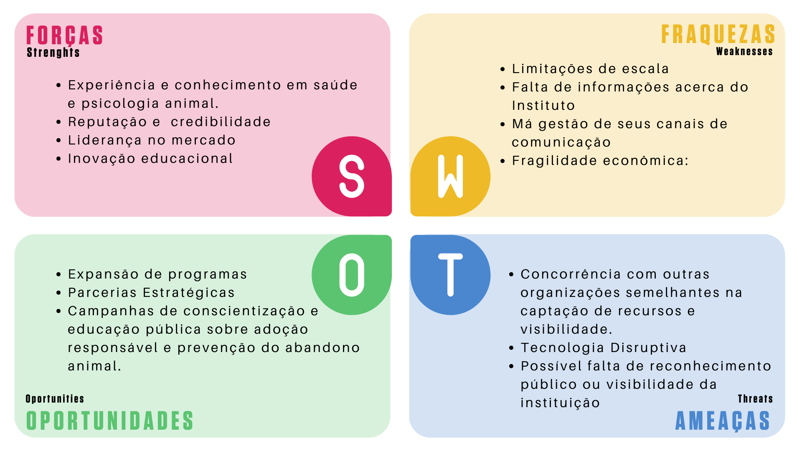
<sup>Fonte: Material produzido pelos autores (2024)</sup>
</div>

**Forças:**
1. **Experiência e conhecimento em saúde e psicologia animal**: O Instituto conta profissionais de qualidade e uma ampla base de conhecimento sólido do ramo da psicologia animal.
2. **Reputação e Credibilidade**: O INSPA possui uma reputação estabelecida como pioneiro no campo educacional brasileiro, especialmente em áreas como bem-estar animal e interação humano-animal.
3. **Liderança e Expertise**: Sob a liderança da Prof. Dra. Ceres Berger Faraco, o INSPA demonstrou liderança e expertise no desenvolvimento de cursos de pós-graduação e programas que abordam questões importantes relacionadas à psicologia animal e à saúde.
4. **Inovação Educacional**: O INSPA é reconhecido por suas realizações notáveis, como o lançamento da primeira pós-graduação em Psicofarmacologia Veterinária, demonstrando um compromisso com a inovação e o avanço do conhecimento nesse campo.

**Fraquezas:** 
1. **Limitações** de Escala: Apesar de suas realizações notáveis, o INSPA pode enfrentar limitações de escala em termos de alcance e capacidade para atender à demanda por educação e treinamento nesse campo.
2. **Falta de informações acerca do Instituto**:  O site não consta com informações importantes sobre a organização, como a história, a missão e os valores, dados os quais podem ser do interesse público.
3. **Má gestão de seus canais de comunicação**: As redes de comunicação do Instituto não estão todas atualizadas e os clientes apontam falhas na comunicação com o Instituto.
4. **Fragilidade econômica**: A fragilidade do instituto diante das flutuações econômicas é definida pelas tarifas aplicadas em seus cursos.

**Oportunidades**
1. **Expansão de Programas**: O INSPA pode explorar oportunidades para expandir sua oferta de programas educacionais, abrangendo uma gama mais ampla de tópicos relevantes para a saúde e o bem-estar dos animais.
2. **Parcerias Estratégicas**: O INSPA pode estabelecer parcerias estratégicas com outras instituições educacionais, organizações governamentais ou empresas privadas para ampliar seu alcance e recursos.
3. **Campanhas de conscientização e educação pública sobre adoção responsável e prevenção do abandono animal**

**Ameaças:**
1. **Concorrência com outras organizações semelhantes na captação de recursos e visibilidade**: O INSPA pode enfrentar concorrência de outras instituições educacionais ou organizações que oferecem programas similares em saúde e psicologia animal.
2. **Tecnologia Disruptiva**: Avanços tecnológicos, como inteligência artificial ou telemedicina veterinária, podem alterar a forma como a educação e os serviços relacionados à saúde animal são entregues, exigindo que o INSPA se adapte para permanecer relevante.
3. **Possível falta de reconhecimento público ou visibilidade da instituição**: O Instituto depende do engajamento do público para manter sua posição, caso o número de visibilidade das realizações caia, as consequências sofridas pela organização são de grande impacto.

&nbsp;&nbsp;&nbsp;&nbsp;&nbsp;&nbsp;Com base nisso, fica evidente que o INSPA se destaca como pioneiro na oferta de cursos de atualização sobre comportamento animal em formato EAD e está determinado a permanecer na vanguarda desta área tão importante da vida
humana e animal. Nesse contexto, a análise SWOT se apresenta como uma ferramenta essencial para identificar e aproveitar oportunidades, mitigar ameaças, potencializar pontos fortes e corrigir fraquezas. Assim, ao utilizar a análise SWOT de forma estratégica, o INSPA pode garantir sua posição de liderança no mercado, oferecendo cursos de qualidade e mantendo-se atualizado em um campo em constante evolução.

### 2.1.4. Solução: 

&nbsp;&nbsp;&nbsp;&nbsp;&nbsp;&nbsp;A solução proposta para o INSPA envolve o desenvolvimento de uma aplicação web multiplataforma, destinada a coletar dados sobre o comportamento humano em relação ao abandono de animais. Este projeto visa superar a falta de estudos científicos globais sobre o assunto, contribuindo significativamente para futuras pesquisas e políticas públicas voltadas à proteção animal.

#### 2.1.4.1. Qual é o problema a ser resolvido:

&nbsp;&nbsp;&nbsp;&nbsp;&nbsp;&nbsp;O INSPA enfrenta o desafio de entender o comportamento humano em relação ao abandono de animais, devido à falta de estudos científicos globais sobre o assunto. Para superar esse desafio, é necessário desenvolver uma ferramenta que possa coletar dados confiáveis sobre esse comportamento, contribuindo para futuras pesquisas.

#### 2.1.4.2. Quais os dados disponíveis :

&nbsp;&nbsp;&nbsp;&nbsp;&nbsp;&nbsp;Não se aplica.

#### 2.1.4.3. Qual a solução proposta:

&nbsp;&nbsp;&nbsp;&nbsp;&nbsp;&nbsp;A solução proposta para o INSPA é o desenvolvimento de uma aplicação web multiplataforma, projetada para coletar dados detalhados sobre o comportamento humano em relação ao abandono de cães. Esta aplicação, acessível em dispositivos móveis, notebooks e desktops, visa superar a falta de estudos globais sobre o tema, fornecendo uma ferramenta robusta para a coleta de informações.

&nbsp;&nbsp;&nbsp;&nbsp;&nbsp;&nbsp;A aplicação permitirá aos usuários mapear os critérios que influenciam as decisões de adoção, compra ou abandono de cães, oferecendo uma visão abrangente e dinâmica do comportamento humano. Essa aplicação visa evitar as limitações associadas ao uso de fotos estáticas, proporcionando uma compreensão mais profunda e contextual do problema.

#### 2.1.4.4. Como a solução proposta deverá ser utilizada:

 &nbsp;&nbsp;&nbsp;&nbsp;&nbsp;&nbsp;A aplicação, acessível via web, será utilizada por tutores de animais e profissionais para a coleta de dados de forma flexível e acessível. A aplicação permitirá mapear os critérios que influenciam a decisão de adoção, compra ou abandono de animais, mostrar experiências de usuários com animais e por fim a análise dos dados coletados valiosos para pesquisas e políticas públicas. A aplicação permitirá:

* Mapeamento de Critérios de Adoção/Compra/Abandono: A plataforma oferecerá ferramentas para mapear os critérios que influenciam a decisão de adoção, compra ou abandono de animais.
* Análise de Dados: A plataforma permitirá a análise dos dados coletados, fornecendo insights valiosos para pesquisas e políticas públicas.

#### 2.1.4.5. Quais os benefícios trazidos pela solução proposta:

&nbsp;&nbsp;&nbsp;&nbsp;&nbsp;&nbsp;A solução proposta beneficia o INSPA e a comunidade ao fornecer um banco de dados para pesquisas, para melhorar políticas públicas, para promover educação e conscientização dos tutores, e para apoiar tutores de animais, contribuindo para a proteção animal:
* Contribuição para Pesquisas: Fornece um banco de dados confiável e diversificado, facilitando a realização de pesquisas sobre o comportamento humano em relação ao abandono de animais.
* Melhoria na Política Pública: Com dados mais precisos, é possível desenvolver políticas públicas mais eficazes para a proteção animal.

#### 2.1.4.6. Qual será o critério de sucesso e qual medida será utilizada para o avaliar:

&nbsp;&nbsp;&nbsp;&nbsp;&nbsp;&nbsp;O critério de sucesso será a eficácia na coleta e análise de dados, avaliado pelo volume e qualidade dos dados coletados, impacto nas pesquisas e políticas públicas, e engajamento dos usuários. Para avaliar esse sucesso, serão utilizadas as seguintes medidas:

* Volume de Dados Coletados: A quantidade de informações sobre animais, critérios de adoção/compra/abandono, e experiências compartilhadas.
* Qualidade dos Dados: A precisão e relevância das informações coletadas, avaliando a qualidade dos dados fornecidos pelos usuários.
* Impacto na Pesquisa e Política Pública: A influência dos dados coletados na realização de pesquisas e na formulação de políticas públicas.
* Engajamento dos Usuários: O número de usuários ativos na plataforma, indicando o engajamento e a utilização da ferramenta.
_Feedback_ dos Usuários: Avaliar o _feedback_ dos usuários sobre a utilidade e a facilidade de uso da plataforma.


### 2.1.5. Proposta de Valor
&nbsp;&nbsp;&nbsp;&nbsp;&nbsp;&nbsp;O Canvas de Proposta de Valor é uma ferramenta fundamental para empreendedores e empresas que desejam desenvolver e comunicar de forma clara o valor de seus produtos ou serviços para os clientes. Ele fornece uma estrutura visual que facilita a definição inicial da proposta de valor e a diferenciação no mercado.

&nbsp;&nbsp;&nbsp;&nbsp;&nbsp;&nbsp;Durante o processo, os empreendedores preenchem os blocos do Canvas, que abordam aspectos como segmentos de clientes, dores e necessidades, soluções oferecidas, canais de comunicação, relacionamentos, recursos-chave, parceiros e estrutura de custos. Cada bloco é preenchido com informações relevantes e estratégicas, proporcionando uma compreensão abrangente da proposta de valor e orientando as decisões de negócios <a href="#Canvas">(Pereira, 2019)</a> .

&nbsp;&nbsp;&nbsp;&nbsp;&nbsp;&nbsp;Dessa maneira, a partir dos encontros com o INPA e a brainstorm do grupo, juntamente com o professor orientador, pode-se realizar o seguinte Canvas de Valor da instituição(Figura 4): 


<div align="center">
<sub>Figura 4 - Canvas de Valor do Instituto de Saúde e Psicologia Animal
</sub>
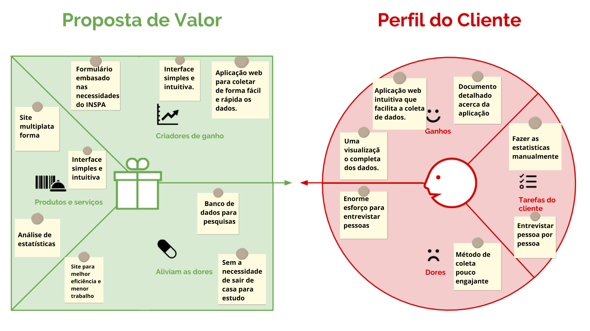
<sup>Fonte: Material produzido pelos autores (2024)</sup>
</div>

#### Tarefas do Cliente :
* O cliente tem que sair de casa para realizar as entrevistas: Para a coleta de dados e para realizar as entrevistas é necessário o cliente sair de casa, já que eles não tem nenhum recurso para resolver isso até agora.

* Entrevistar pessoa por pessoa na rua: Além de terem que sair de casa para fazer as entrevistas, o trabalho também não é nada eficiente, já que ele é muito demorado pelo fato do trabalho de entrevistar pessoa por pessoa.

* Fazer as estatísticas manualmente: após realizar todas as entrevistas, a partir delas são realizadas de forma manual todas estatísticas da pesquisa.

#### Ganhos:

* Aplicação web simples e efetiva para facilitar a coleta de dados: A aplicação web vai facilitar todo o processo de coleta de dados e entrevistas já que o cliente não terá mais que sair de casa e produzir as estatísticas a mão, desse jeito acelerando o projeto.

* O cliente espera obter um documento detalhado explicando todo o processo construtivo da aplicação: O cliente receberá um documento chamado “WAD” (Web Application Document), nele ele terá uma explicação completa e detalhada sobre o processo de desenvolvimento do projeto.

* Uma visualização completa das estatísticas do formulário: com o uso da aplicação web será possível visualizar de maneira geral e detalhada todas as estatísticas da pesquisa.

#### Dores:

 * Enorme esforço para realizar a coleta de dados: Além da demora para coletar os dados, também tem a parte de extrair eles das pesquisas, oque é bem desgastante e demora muito tempo.

 * Ter que sair na rua e entrevistar pessoa por pessoa: O cliente tem que sair de casa e entrevistar diversas pessoas na rua, oque é algo cansativo e que demanda muito tempo do cliente, além de não ser eficiente.

 * Método de coleta pouco eficiente: Sair de casa e entrevistar pessoas na rua é algo nem um pouco eficiente e que leva um trabalho e tempo enorme para ser feito.

#### Criadores de Ganho:

* Interface simples e intuitiva: Através dessa interface será possível tornar a experiência do usuário muito mais completa e gratificante, pois a sua intuitividade fará com que até mesmo pessoas mais leigas em tecnologia consigam utilizá-la de forma completa.

* Uso de perguntas de formulário que foram criadas e pensadas pelo próprio cliente: Com o uso das perguntas adaptadas pelo próprio cliente é possível obter as melhores e mais desejadas respostas.  

* Uso da aplicação web para coletar os dados: O uso da aplicação web faz com que o trabalho de coleta de dados seja mais fácil e rápido.

* Uso de banco de dados: facilita todo o processo de armazenamento de informações e auxilia na criação de estatísticas.

#### Aliviadores de Dores:

* Uso do site para melhor eficiência e menor trabalho: O uso do site facilita toda a coleta de informações e também deixa o processo muito mais simples e curto, obtendo um resultado mais preciso.

* Uso de banco de dados para contribuir com as estatísticas da pesquisa: Faz com que as estatísticas possam ser formadas automaticamente, conforme as pessoas vão respondendo.

* Não ter que sair de casa para fazer a entrevista: A dor de sair de casa será resolvida já que a pesquisa será feita 100% pela internet.

#### Produtos e Serviços:

* Site multiplataforma: assim a pessoa poderá realizar o formulário a qualquer momento.

* Interface simples e intuitiva: com essa interface o site poderá ser usado por pessoas de todas as idades, já que será super prática e intuitiva.

* Análise completa de estatísticas: dentro da parte do administrador, será possível ter um relatório de análises completas das respostas ao formulário.


&nbsp;&nbsp;&nbsp;&nbsp;&nbsp;&nbsp;Ao final do processo, o Canvas de Proposta de Valor oferece uma visão clara e compartilhada do valor que o produto ou serviço proporciona aos clientes. Ele serve como um guia para ajustes e alinhamentos estratégicos, permitindo que as empresas atendam de forma eficaz às demandas do mercado e entreguem valor de maneira consistente.


### 2.1.6. Matriz de Riscos

&nbsp;&nbsp;&nbsp;&nbsp;&nbsp;&nbsp;Uma matriz de risco é uma ferramenta utilizada para avaliar e gerenciar os riscos em projetos, processos ou empreendimentos. 

Ela organiza os riscos em uma matriz, geralmente com eixos que representam a probabilidade de ocorrência e o impacto dos riscos. Isso permite priorizar ações para mitigar ou evitar os riscos mais significativos, ajudando a garantir o sucesso do projeto ou empreendimento. Além disso, é importante ressaltar que a matriz de risco é dinâmica e muda de acordo com o andamento do projeto, pois novos riscos podem surgir, enquanto outros podem se tornar menos relevantes. 

&nbsp;&nbsp;&nbsp;&nbsp;&nbsp;&nbsp;Portanto, é essencial revisá-la periodicamente para manter o controle eficaz dos riscos ao longo do tempo.


<div align="center">
<sub>Figura 5 - Matriz de Risco do Projeto - Sprint 1</sub>
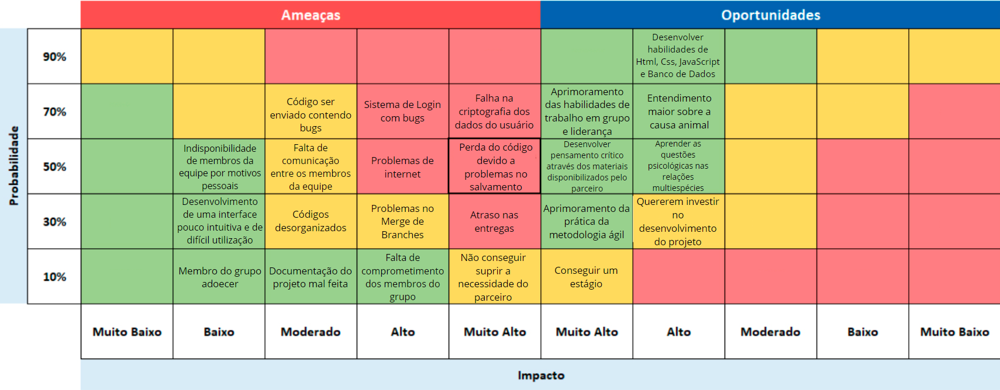
<sup>Fonte: Material produzido pelos autores (2024)</sup>
</div>

Ameaças | Plano de Ação
--- | --- 
Atraso nas entregas | Buscar comprometimento e atenção aos prazos estabelecidos para evitar atrasos
Código ser enviado contendo bugs | Realizar revisões do código no final de cada sprint para identificar e corrigir bugs antes das entregas
Códigos desorganizados | Seguir as boas práticas de programação para manter o código organizado e de fácil compreensão
Desenvolvimento de uma interface pouco intuitiva e de difícil utilização | Estudar interfaces de grandes sites e utilizá-las como inspiração para melhorar a usabilidade da interface
Documentação do projeto mal feita | Realizar revisões constantes e validações dos tópicos com o orientador para garantir a qualidade da documentação
Falha na criptografia dos dados do usuário | Realizar diversos testes de tentativa de quebra de criptografia para garantir a segurança dos dados
Falta de comprometimento dos membros do grupo | Conversar com o membro sem comprometimento para entender o que está acontecendo e tomar medidas para mudar essa situação
Falta de comunicação entre os membros da equipe | Praticar a escuta ativa e aprimorar os meios de comunicação para garantir uma colaboração eficaz
Falta de entendimento do projeto | Realizar revisões constantes com o orientador para esclarecer dúvidas
Indisponibilidade de membros da equipe por motivos pessoais | Avisar previamente sobre a indisponibilidade para redistribuir tarefas ou reajustar prazos conforme necessário
Membro do grupo adoecer | Redirecionar suas tarefas para os outros membros do grupo
Não conseguir suprir a necessidade do parceiro | Negociar metas e estudar maneiras mais eficientes de atingi-las em conjunto
Perda do código devido a problemas no salvamento | Sempre verificar se o commit foi efetuado adequadamente para garantir a segurança do código
Problemas de internet | Sempre realizar commits quando estiver conectado à internet e manter a versão mais recente do projeto no dispositivo
Problemas no Merge de Branches | Tirar dúvidas sobre como realizar o merge de branches com o orientador para evitar problemas
Sistema de Login com bugs | Realizar diversos testes para garantir a qualidade do sistema de login e corrigir quaisquer problemas identificados

&nbsp;&nbsp;&nbsp;&nbsp;&nbsp;&nbsp;Assim, quando se trata do desenvolvimento de um projeto, é crucial a realização de uma matriz de risco, a fim de entender as possíveis taxas de sucesso e conclusão da iniciativa.

<br>


## 2.2. Personas

&nbsp;&nbsp;&nbsp;&nbsp;&nbsp;&nbsp;A construção de personas  é uma prática comum para qualquer empresa que busca compreender profundamente o seu público-alvo. Uma persona é uma representação fictícia de um cliente ideal, baseada em diversos dados diferentes, como idade, região demográfica, poder aquisitivo e entre diverso outros <a href="#Persona">(Peçanha, 2020)</a>.

&nbsp;&nbsp;&nbsp;&nbsp;Ao criar personas detalhadas e realistas, profissionais de marketing podem orientar e adaptar suas estratégias para atender às expectativas e resolver os problemas reais enfrentados por esses grupos preescritos.

&nbsp;&nbsp;&nbsp;&nbsp;Dessa maneira, para ocorrer o mapeamento e a prototipação mais assertiva possível, foi realizada o desenvolvimento das personas ideias (Figuras 6 à 8) para aplicação WEB do o Instituto de Psicologia Animal.

### 2.2.1. Persona 1
Persona Murilo Escobar (Figura 6)
<div align="center">
<sub>Figura 6 - Persona 1</sub> <br>
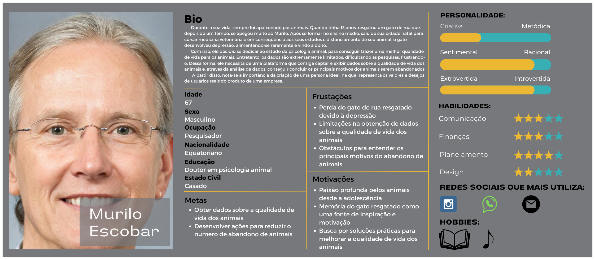<br>
<sup>Fonte: Imagem gerada por IA e Template gerado por autoria própria (2024)</sup>
</div>	
&nbsp;&nbsp;&nbsp;&nbsp;&nbsp;&nbsp;      Durante a sua vida, sempre foi apaixonado por animais. Quando tinha 13 anos, resgatou um gato de rua que, depois de um tempo, se apegou muito ao Murilo. Após se formar no ensino médio, saiu de sua cidade natal para cursar medicina veterinária e em consequência aos seus estudos e distanciamento de seu animal, o gato desenvolveu depressão, alimentando-se raramente e vindo a óbito.
Com isso, ele decidiu se dedicar ao estudo da psicologia animal, para conseguir trazer uma melhor qualidade de vida para os animais. Entretanto, os dados são extremamente limitados, dificultando as pesquisas, frustrando-o. Dessa forma, ele necessita de uma plataforma que consiga captar e exibir dados sobre a qualidade de vida dos animais e, através da análise de dados, conseguir concluir os principais motivos dos animais serem abandonados.
A partir disso, nota-se a importância da criação de uma persona ideal, na qual representa os valores e desejos
de usuários reais do produto de uma empresa.

### 2.2.2. Persona 2

Persona Cecília Alves (Figura 7)
<div align="center">
<sub>Figura 7 - Persona 2</sub><br>
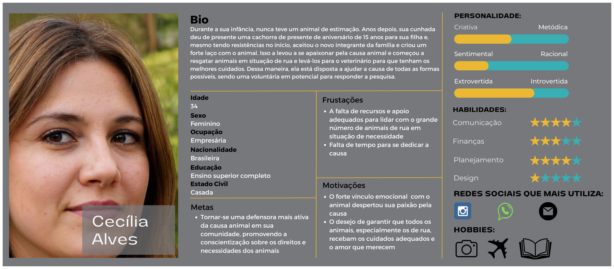<br>
<sup>Fonte: Imagem gerada por IA e Template gerado por autoria própria (2024)</sup>
</div>

&nbsp;&nbsp;&nbsp;&nbsp;&nbsp;&nbsp;Durante a sua infância, nunca teve um animal de estimação. Anos depois, sua cunhada deu de presente uma cachorra de presente de aniversário de 15 anos para sua filha e, mesmo tendo resistências no início, aceitou o novo integrante da família e criou um forte laço com o animal. Isso a levou a se apaixonar pela causa animal e começou a resgatar animais em situação de rua e levá-los para o veterinário para que tenham os melhores cuidados. Dessa maneira, ela está disposta a ajudar a causa de todas as formas possíveis, sendo uma voluntária em potencial para responder a pesquisa.


### 2.2.3. Persona 3

Persona Trevor Philips (Figura 8)

<div align="center">
<sub>Figura 8 - Persona 3</sub>
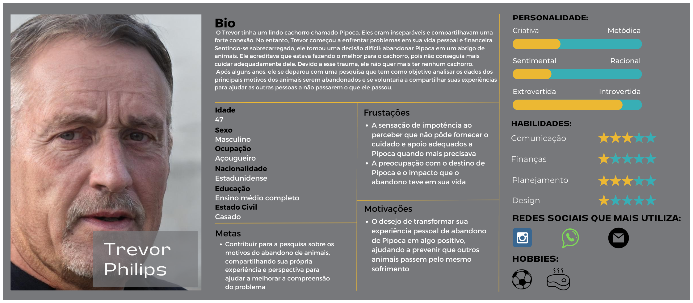
<sup>Fonte: Imagem gerada por IA e Template gerado por autoria própria (2024)</sup>
</div>

&nbsp;&nbsp;&nbsp;&nbsp;&nbsp;&nbsp; O Trevor tinha um lindo cachorro chamado Pipoca. Eles eram inseparáveis e compartilhavam uma forte conexão. No entanto, Trevor começou a enfrentar problemas em sua vida pessoal e financeira. Sentindo-se sobrecarregado, ele tomou uma decisão difícil: abandonar Pipoca em um abrigo de animais. Ele acreditava que estava fazendo o melhor para o cachorro, pois não conseguia mais cuidar adequadamente dele. Devido a esse trauma, ele não quer mais ter nenhum cachorro.
Após alguns anos, ele se deparou com uma pesquisa que tem como objetivo analisar os dados dos principais motivos dos animais serem abandonados e se voluntaria a compartilhar suas experiências para ajudar as outras pessoas a não passarem o que ele passou.

### 2.2.4. Persona 4

Persona Isadora Versan (Figura XXX)

<div align="center">
<sub>Figura XXX - Persona 4</sub>

<sup>Fonte: Imagem gerada por IA e Template gerado por autoria própria (2024)</sup>
</div>

&nbsp;&nbsp;&nbsp;&nbsp;&nbsp;&nbsp;      Isadora, uma professora dedicada e entusiasta dos animais desde a infância, foi criada em um ambiente onde cachorros e gatos eram membros queridos da família. Sua conexão especial com os animais moldou não apenas sua vida pessoal, mas também sua abordagem pedagógica. Como educadora, Isadora não vê apenas a sala de aula como um espaço para transmitir conhecimento acadêmico, mas também como uma oportunidade para cultivar em seus alunos a empatia e o respeito pelos seres vivos que compartilham o planeta conosco.
No entanto, mesmo com sua dedicação incansável, Isadora não pode ignorar as dolorosas realidades que enfrenta em sua comunidade. Ela testemunha, com tristeza, os casos crescentes de animais abandonados e negligenciados, muitas vezes vítimas da falta de compreensão ou recursos. Essas situações despertam uma chama ainda mais forte dentro dela, alimentando sua determinação em fazer algo significativo para mudar essa realidade.

### 2.2.5. Persona 5

Persona Júlia Marfretti (Figura XXX)

<div align="center">
<sub>Figura XXX - Persona 5</sub>

<sup>Fonte: Imagem gerada por IA e Template gerado por autoria própria (2024)</sup>
</div>

&nbsp;&nbsp;&nbsp;&nbsp;&nbsp;&nbsp;      Júlia é uma garora de 39 anos, designer que, acredita que com 
suas habilidades ela pode inovar o mundo do web design, porém
ela acredita que não tem o devido reconhecimento, e que a forma como formulários devem ser feitos, deveria ser completamente intuitiva e mais divertida

### 2.2.6. Persona 6

Persona Ricardo Morata (Figura XXX)

<div align="center">
<sub>Figura XXX - Persona 6</sub>
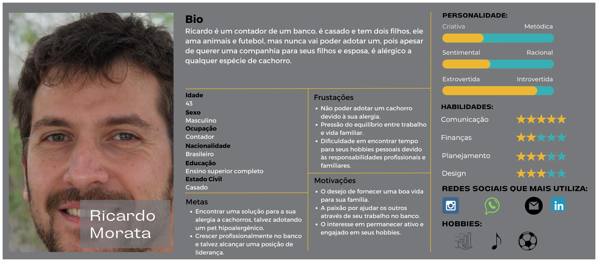
<sup>Fonte: Imagem gerada por IA e Template gerado por autoria própria (2024)</sup>
</div>

&nbsp;&nbsp;&nbsp;&nbsp;&nbsp;&nbsp;      Ricardo é um contador de um banco, é casado e tem dois filhos, ele ama animais e futebol, mas nunca vai poder adotar um, pois apesar de querer uma companhia para seus filhos e esposa, é alérgico a qualquer espécie de cachorro.

### 2.2.7. Persona 7

Persona Alice Morais (Figura XXX)

<div align="center">
<sub>Figura XXX - Persona 7</sub>
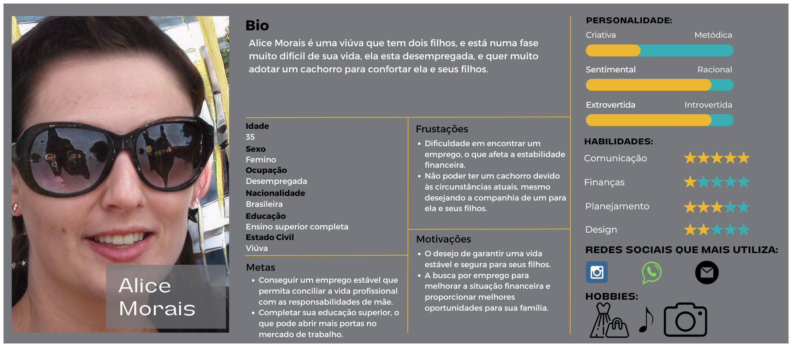
<sup>Fonte: Imagem gerada por IA e Template gerado por autoria própria (2024)</sup>
</div>

&nbsp;&nbsp;&nbsp;&nbsp;&nbsp;&nbsp;      Alice Morais é uma viúva que tem dois filhos, e está numa fase muito dificil de sua vida, ela esta desempregada, e quer muito adotar um cachorro para confortar ela e seus filhos.

<p id ="us"></p>

## 2.3. User Stories

&nbsp;&nbsp;&nbsp;&nbsp;Muito utilizado em aplicações WEB, user stories são descrições simples de funcionalidades ou requisitos do ponto de vista do usuário. As quais costumam seguir o seguinte formato:"Como [tipo de usuário], eu quero [funcionalidade] para [finalidade]". 

&nbsp;&nbsp;&nbsp;&nbsp;As user stories ajudam as equipes a entender e priorizar as necessidades dos usuários finais, garantindo que o produto final atenda às expectativas e agregue valor aos clientes. Nessa perspectiva, para a realização de um produto adequado, foi desenvolvido algumas user stories(tabela):

&nbsp;&nbsp;&nbsp;&nbsp;Identificação | US1
--- | ---
**Persona** | Trevor Philips
**_User Story_** | "Como uma pessoa que teve complicações na adoção, porém pouco motivado a responder os formulários, posso contribuir ao compartilhar minha experiência para informar outras pessoas sobre os impasses na adoção".
**Critério de aceite 1** | A tela inicial deve possuir uma instrução de como prosseguir para responder o formulário. 
**Testes de Aceite** | O usuário ao entrar no site verifica se possui orientação sobre as etapas antes do formulário <br><br>Tem acesso a um tópico na tela inicial que o contextualiza sobre os passos para ir ao formulário = Correto. <br><br> Não tem acesso a qualquer tipo de contextualização = Incorreto, deve ser corrigido.
**Critério de aceite 2** | O site deve possuir textos e elemento que aproximem o usuário da causa, assim causando mais motivação ao usuário para responder o formulário.
**Testes de Aceite** | Durante a navegação no site o usuário verifica se existem utensílios contextualizadores e consientizadores. <br><br>O usuário se depara com diversos recursos e materiais conscientizadores sobre o abandono zero, aproximando-o com a 	causa = Correto.<br><br>O usuário não vê nenhum elemento explicativo sobre a motivação do projeto e fica desmotivacionado a responder os 	formulários = Incorreto, deve ser corrigido.

&nbsp;&nbsp;&nbsp;&nbsp;Identificação | US2
--- | ---
**Persona** | Alice Morais
**_User Story_** | "Como uma pessoa que está querendo adotar um cão, posso contribuir ao compartilhar as minhas motivações para ajudar a causa com mais dados".
**Critério de aceite 1** | O site deve possuir um "menu guia" que orienta intuitivamente o usuário aos outros tópicos da aplicação.
**Testes de Aceite** | Ao acessar o site o usuário procura um menu onde está localizado as outras páginas da aplicação. <br><br>O usuário no menu inicial obtém um menu simples e intuitivo que o garante acesso aos outros tópicos do site = Correto. <br><br>O usuário não tem acesso a um menu = Incorreto, deve ser corrigido.
**Critério de aceite 2** | A tela de menu deve possuir um acesso a equipe de suporte da aplicação Web.
**Testes de Aceite** | O usuário ao acessar a tela de menu verifica se ela possui algum elemento que leve o usuário ao contato com a equipe de suporte.<br><br>A tela de menu possui ícones intuitivos que ao clicar levarão o usuário ao contato com a equipe de suporte da aplicação 	= Correto. <br><br>A tela de menu não possui nenhum meio de contato = Incorreto, deve ser corrigido.

&nbsp;&nbsp;&nbsp;&nbsp;Identificação | US3
--- | ---
**Persona** | Cecília Alvez
**_User Story_** | "Como uma apaixonada na causa animal, posso contribuir no formulário para ajudar nessa motivação".
**Critério de aceite 1** | Durante a navegação do site o usuário deve ter acesso a uma tela de cadastro, caso não tenha uma conta na aplicação.
**Testes de Aceite** | Ao acessar o site o usuário verifica se tem a possibilidade de se cadastrar no site. <br><br>O usuário ao seguir para os formulários, caso não esteja logado no site, se depara com uma tela de cadastro = Correto.<br><br> O usuário não tem acesso a uma tela de cadastro em nenhum momento = Incorreto, deve ser corrigido
**Critério de aceite 2** | A aplicação deve possuir uma página de login, caso já tenha feito o cadastro no site. 
**Testes de Aceite** | Durante a navegação do site, o usuário ao se direcionar para os formulários verifica se tem acesso a uma tela de login. <br><br> Após fazer o cadastro ou comunicar que já tem uma conta, o usuário é guiado para um tela de login = Correto.<br> <br> O usuário não tem acesso a momento nenhum a tela de login = Incorreto, deve ser corrigido.

&nbsp;&nbsp;&nbsp;&nbsp;Identificação | US4
--- | ---
**Persona** | Júlia Marfretti
**_User Story_** | "Como uma designer, quero verificar se o site possui as qualidades para que usuários não se sintam entendiados durante o formulário".
**Critério de aceite 1** | O formulário deve possuir maneiras dinâmicas e simples de responder as perguntas.
**Testes de Aceite** | O usuário verifica se ao responder as perguntas não se sente enfadado ao responder o formulário. <br><br>Com perguntas dinâmicas e diferentes, usuário não sente nenhum tipo de fadiga durante o formulário = Correto.<br><br> O usuário se sente cansado e entediado respondendo as perguntas = Incorreto, deve ser corrigido.
**Critério de aceite 2** | Durante o processo de responder o formulário, o usuário não deve ter nenhum tipo de dúvida ou falta de clareza em sentido as perguntas feitas.
**Testes de Aceite** | Ao ter acesso as perguntas do site, o usuário verifica se nas perguntas existe falta sentido e compreensibilidade. <br><br> O usuário verificou que as perguntas do site não precisam de muita intepretação de texto e que os textos são de fácil leitura = Correto.<br><br> O usuário verificou que as perguntas são complexas e de difícil entendimento = Incorreto, deve ser corrigido.

&nbsp;&nbsp;&nbsp;&nbsp;Identificação | US5
--- | ---
**Persona** | Isadora Versan
**_User Story_** | "Como um professora do ensino fundamental, eu quero poder ter acesso a um site intuitivo e simples, para que pessoas não tão adeptos a tecnologia, como meus alunos, também possam ajudar na causa".
**Critério de aceite 1** | O site deve possuir um método de acompanhar o progresso conforme o usuário vá respondendo as perguntas.
**Testes de Aceite** | O usuário responde as perguntas e verifica se há alguma maneira de ter acesso ao andamento dele nas perguntas. <br><br>O usuário nota que há uma barra de progresso que aumenta conforme as perguntas do formulário vão sendo respondidas = 	Correto.<br><br> O usuário não reconhece qualquer tipo de ferramenta de acompanhamento de progresso = Incorreto, deve ser corrigido.
**Critério de aceite 2** | No final de cada formulário, é necessário haver um botão que confirme que o usuário enviou suas respostas, para que não gere dúvidas no mesmo.
**Testes de Aceite** | O usuário após a conclusão de cada formulário deve ter acesso a algum elemento que confirme que ele enviou suas respostas.<br><br> Ao completar cada formulário, o usuário se depara com um botão de enviar as respostas, fazendo com que o usuário tenha certeza que respondeu tudo e se direcione para outras etapas = Correto.<br><br> Logo após cada formulário o usuário fica em dúvida se as respostas foram enviadas, pois não existe nenhum meio de 	confirmação do mesmo = Incorreto, deve ser corrigido.

&nbsp;&nbsp;&nbsp;&nbsp;Identificação | US6
--- | ---
**Persona** | Ricardo Morata
**_User Story_** | "Como uma pessoas alérgica e incapaz de adotar um cachorro, eu quero poder responder o formulário para ajudar na causa animal".
**Critério de aceite 1** | O site deve possuir um formulário específico para pessoas que não querem/podem ter cachorro.
**Testes de Aceite** | Ao acessar a página de formulários, o usuário verifica se existe a opção para pessoas que não conseguem ter um cão. <br><br>O usuário que não quer ou são capazes de ter cachorro, também tem a opção de responder o formulário, com um caixa de perguntas específica =  Correto.<br><br> O site possui apenas formulários para pessoas que tem, ja tiveram ou querem ter cachorros = Incorreto, deve ser corrigido.
**Critério de aceite 2** | Depois de respondido todos os formulários o usuário deve ter acesso a uma página que confirme que ele enviou todas suas respostas e um botão que o leve de volta a página de ínicio.
**Testes de Aceite** | O usuário, após responder os formulários, verifica se algum método que confime que ele acabou de responder todos os formulários.<br><br>Assim que acabado os formulários, o usuário é guiado a uma página específica que o confirma a finalização das perguntas 	e o encaminha a página inicial = Correto.<br><br> Assim que acabado os formulários, o usuário é deixado em estado de confusão, pois não recebe feedback de que acabou as perguntas = Incorreto, deve ser corrigido.

&nbsp;&nbsp;&nbsp;&nbsp;Identificação | US7
--- | ---
**Persona** | Murilo Escobar
**_User Story_** | "Como um doutor em psicologia animal, pretendo utilizar dados sobre adoções de cães para analisar prováveis causas de abandono".
**Critério de aceite 1** | O site deve possuir uma página de visualização de dados.
**Testes de Aceite** | O pesquisador verifica se há alguma forma de visualizar gráficos e informações de todos os formulários respondidos.<br><br>O pesquisador tem acesso a uma página com todos os dados das perguntas respondidas, assim permitindo que ele use para suas pesquisas = Correto.<br><br> O pesquisador não tem acesso a qualquer tipo de método para visualização de dados = Incorreto, deve ser corrigido.
**Critério de aceite 2** | A página de visualização de dados deve requisitar um usuário administrador e uma senha.
**Testes de Aceite 1** | O pesquisador oferece e-mail e senha de administradores válidos.<br><br>Ele recebe o direito de administrador = Correto.<br><br>Ele não recebe o direito de administrador = Incorreto, deve ser corrigido.
**Testes de Aceite 2** | O pesquisador oferece e-mail e senha de administradores inválidos.<br><br>Ele recebe o direito de administrador = Incorreto, deve ser corrigido.<br><br>Ele não recebe o direito de administrador = Correto.

&nbsp;&nbsp;&nbsp;&nbsp;A partir do apresentado, o desenvolvimento de user stories facilitam o entendimento de stakehoders acerca de um projeto e auxiliam no alinhamento de expectativas, sendo crucial na prototipação de um projeto.


# <a name="c3"></a>3. Projeto da Aplicação Web 

## 3.1. Arquitetura 

&nbsp;&nbsp;&nbsp;&nbsp;&nbsp;&nbsp;A arquitetura de uma aplicação web é a estrutura que define como ela funciona. Nesse projeto desenvolvido para o INSPA, está sendo utilizado o padrão de arquitetura MVC (Model-View-Controller) que divide a aplicação em três componentes principais: Modelo, Visão e Controlador. Este padrão facilita a organização do projeto, promovendo a separação de conceitos em três camadas interconectadas, focadas na manipulação de dados (Modelo), interação do usuário (Visão) e camada de controle (Controlador). É dividida em:

* **Modelo (Model)**: Camada responsável por lidar com todos os dados, lógica e regras de negócios. Um modelo representa um objeto ou um conjunto de objetos, acessando, manipulando e enviando dados para a visão.
* **Visão (View)**: Camada responsável por mostrar os dados para o usuário. É usada apenas para representação gráfica dos dados da camada Modelo.
* **Controlador (Controller)**: Camada que atua como intermediário entre o Modelo e a Visão, processando todas as solicitações e manipulando os dados usando o componente do modelo, exibindo os dados na visão.

&nbsp;&nbsp;&nbsp;&nbsp;&nbsp;&nbsp;Neste projeto, a aplicação foi dividida em quatro arquiteturas para facilitar a organização e o desenvolvimento, seguindo o padrão MVC (Model-View-Controller). Cada uma dessas arquiteturas tem um propósito específico e contribui para a estrutura geral da aplicação web.

### Fluxo de Dados

O fluxo de dados entre as camadas segue um padrão específico:
- O **Controlador** recebe as solicitações do usuário e as direciona ao **Modelo** adequado.
- O **Modelo** processa os dados conforme necessário e retorna os resultados ao **Controlador**.
- O **Controlador**, então, atualiza a **Visão** com os dados processados pelo **Modelo**.

&nbsp;&nbsp;&nbsp;&nbsp;&nbsp;&nbsp;Este fluxo garante que a aplicação mantenha-se organizada e fácil de manter.

### Especificações Técnicas

- **Linguagens e Frameworks**: A aplicação utiliza JavaScript e Sails.js para utilizar a arquitetura MVC completa.
- **Banco de Dados**: A aplicação utiliza PostgreSQL para armazenar os dados, aproveitando sua robustez e confiabilidade.
- **Servidor**: A aplicação utiliza Render para armazenar os dados do Banco de dados.
- **Autenticação**: A aplicação utiliza Auth0 para autenticação e autorização dos usuários, garantindo a segurança das sessões e simplificando o processo de gerenciamento de identidade e acesso.

### Arquitetura Tutor

&nbsp;&nbsp;&nbsp;&nbsp;&nbsp;&nbsp;A arquitetura Tutor é responsável pela interação entre o tutor e o site inicial. Ela inclui a lógica para listar e procurar os dados para verificar se o usuário já está logado ou não no site. Esta arquitetura é crucial, pois redireciona para as outras arquiteturas, dependendo do estado do usuário (Figura 9).

<div align="center">
<sub>Figura 9 - Arquitetura Tutor</sub>
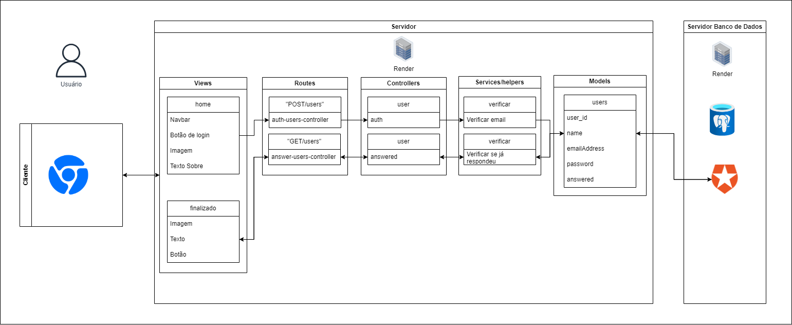
<sup>Fonte: Material produzido pelos autores (2024)</sup>
</div>

#### Fluxo de Operações

**Login**:
- O usuário preenche suas credenciais na página de login.
- O controlador `tutor` ativa o método `procurar` para verificar as credenciais.
- Se as credenciais estiverem corretas, o usuário é redirecionado ao dashboard apropriado (usuário ou administrador).

### Arquitetura Formulários

&nbsp;&nbsp;&nbsp;&nbsp;&nbsp;&nbsp;A arquitetura Formulários é focada na coleta e processamento de dados dos usuários através de formulários. Ela inclui a lógica para listar e gravar os dados, garantindo que sejam coletados de forma eficiente e segura. Esta arquitetura é essencial para a interação do usuário com a aplicação, permitindo a entrada de informações para as pesquisas (Figura 10).

<div align="center">
<sub>Figura 10 - Arquitetura Formulários</sub>
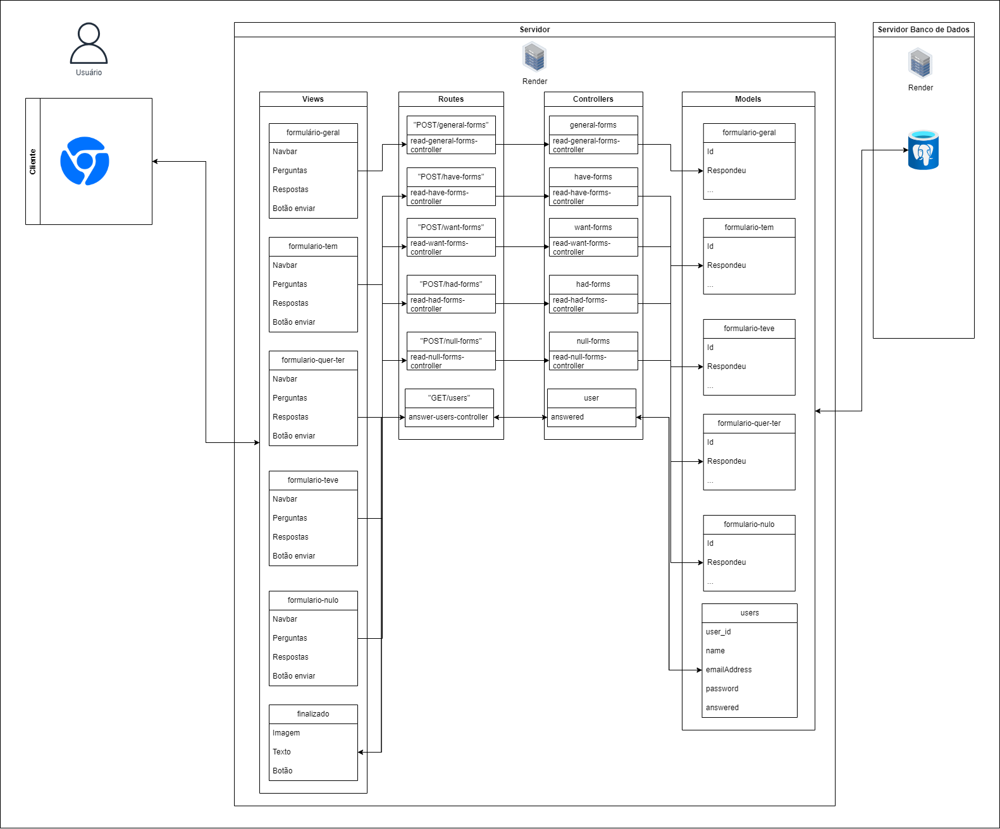
<sup>Fonte: Material produzido pelos autores (2024)</sup>
</div>

#### Fluxo de Operações

**Preenchimento dos Formulários**:
- O usuário acessa o formulário específico e preenche as informações requeridas.
- O controlador `forms` recebe os dados, valida-os e utiliza o método `gravar` para inserir as informações no banco de dados através do modelo correspondente.

**Exemplos de Formulários**:
- **Tabela General Forms**: Dados demográficos como idade, sexo, nível de escolaridade.
- **Tabela have_forms**: Informações sobre cachorros que os usuários possuem.
- **Tabela want_forms**: Preferências para um futuro cachorro.
- **Tabela had_forms**: Informações sobre cachorros que já tiveram.
- **Tabela dont_want_forms**: Motivos para não querer um cachorro.


### Arquitetura Admin

&nbsp;&nbsp;&nbsp;&nbsp;&nbsp;&nbsp;A arquitetura Admin é dedicada à gestão administrativa da aplicação. Ela inclui funcionalidades para gerenciar os formulários, relatórios e análises. Esta arquitetura é crucial para o controle e monitoramento do sistema, permitindo aos administradores visualizar as estatísticas das pesquisas (Figura 11).

<div align="center">
<sub>Figura 11 - Arquitetura Admin</sub>
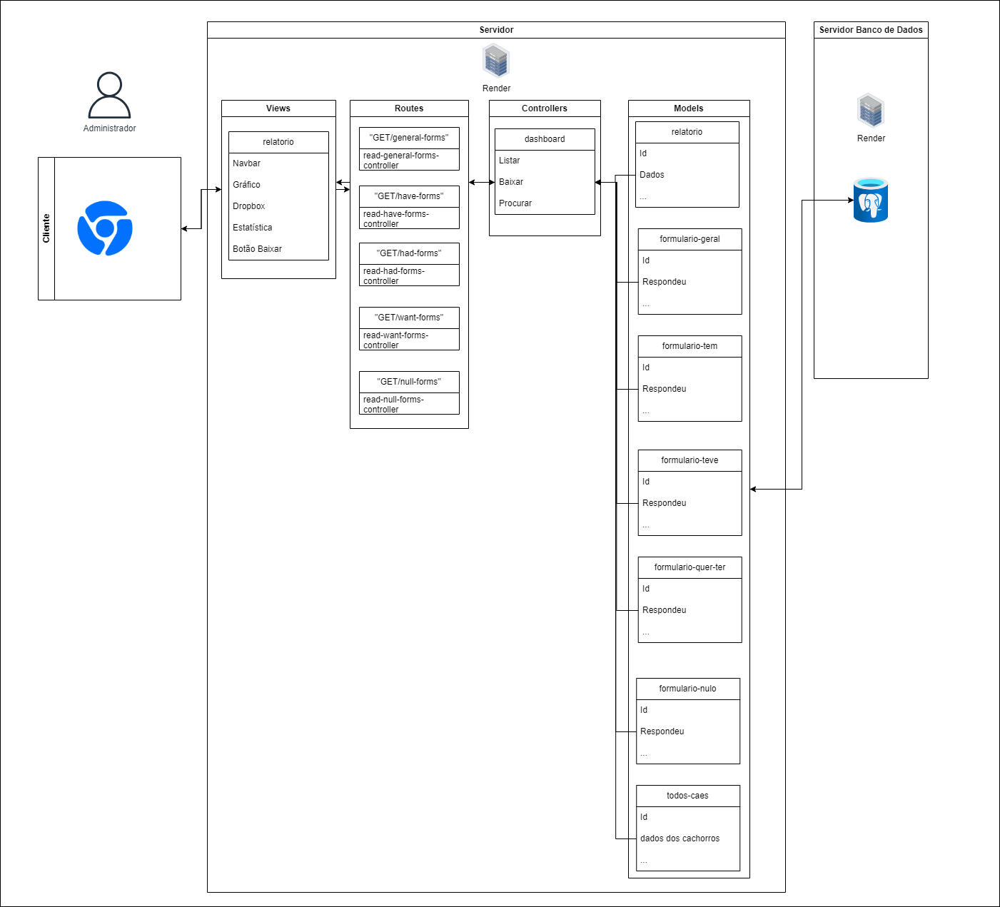
<sup>Fonte: Material produzido pelos autores (2024)</sup>
</div>

#### Fluxo de Operações

**Visualização no Dashboard Administrativo**:
- O administrador acessa o dashboard.
- O controlador `admin` executa os métodos `procurar` e `listar` para buscar e exibir os dados dos modelos pertinentes.
- As respostas dos formulários são apresentadas em gráficos e resumos estatísticos.
- O administrador pode filtrar ou selecionar dados específicos para visualizar ou exportar, usando os controles disponíveis na view.

### Arquitetura Login

&nbsp;&nbsp;&nbsp;&nbsp;&nbsp;&nbsp;A arquitetura Login é responsável pela autenticação e autorização dos usuários, bem como a verificação de administradores. Ela inclui a lógica para o registro de novos usuários, login e recuperação de senha. Esta arquitetura é fundamental para validar os usuários e cadastrar novos (Figura 12).

<div align="center">
<sub>Figura 12 - Arquitetura Login</sub>
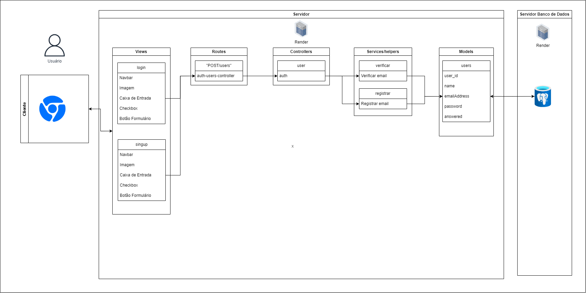
<sup>Fonte: Material produzido pelos autores (2024)</sup>
</div>

#### Fluxo de Operações

**Cadastro**:
- O usuário acessa a página de cadastro, preenche os campos necessários e submete o formulário.
- O controlador `login` recebe os dados, valida-os e utiliza o método `gravar` para inserir as informações no banco de dados através do modelo `users`.
- Após o registro, o usuário pode ser redirecionado para a página de login ou diretamente para o dashboard, dependendo do role.

**Login**:
- O usuário preenche suas credenciais na página de login.
- O controlador `login` ativa o método `procurar` para verificar as credenciais.
- Se as credenciais estiverem corretas, o usuário é redirecionado ao dashboard apropriado (usuário ou administrador).

&nbsp;&nbsp;&nbsp;&nbsp;&nbsp;&nbsp;Essas arquiteturas permitem que o projeto seja organizado, claro e eficiente, facilitando a manutenção, testabilidade, extensibilidade e escalabilidade, tornando este projeto flexível e escalável para ser desenvolvido em grande porte.


## 3.2. _Wireframes_ 


&nbsp;&nbsp;&nbsp;&nbsp;&nbsp;&nbsp;O _Wireframe_ é um protótipo da página de uma aplicação, ou seja, uma espécie de rascunho ou esboço. Essa ferramenta é utilizada para criar _layouts_ simples que visam atender às necessidades dos usuários. O wireframe ajuda a definir a estrutura da página, a arquitetura da informação, o fluxo do usuário (_User Flow_) e a funcionalidade do aplicativo ou site, sendo fundamental para o planejamento e desenvolvimento de projetos <a href="#Wireframe">(Wireframes: [...], 2020)</a>. É a primeira etapa do _design_, focando nas funcionalidades e organização, sem se preocupar com detalhes visuais, tais como cores e estilos.


&nbsp;&nbsp;&nbsp;&nbsp;&nbsp;&nbsp;Existem três tipos de _Wireframes_:

* Baixa fidelidade: Representa um esboço básico sem cores e com poucos detalhes, focando na estrutura geral.
* Média fidelidade: Avança do esboço básico, incluindo mais detalhes e uma representação mais precisa do produto final, mas ainda sem detalhes visuais.
* Alta fidelidade: Mostra a estrutura do produto final com detalhes visuais claros, representando o design final antes da implementação.

&nbsp;&nbsp;&nbsp;&nbsp;&nbsp;&nbsp;Portanto, os Wireframes são importantes ferramentas de desenvolvimento, pois facilitam a experimentação de novas possibilidades e a definição de funcionalidades pretendidas. Além disso, melhoram a comunicação e o alinhamento de ideias com clientes e partes interessadas, facilitando a tomada de decisão.

&nbsp;&nbsp;&nbsp;&nbsp;&nbsp;&nbsp;Nesse projeto está sendo usado o conceito de é mobile first (celular primeiro), que é um projeto que faz a criação de projetos web e sites primeiro em dispositivos móveis, para depois fazer adaptações para o desktop e outras plataformas, dessa forma o wireframe foi desenvolvido para celular e adaptado para o desktop.

<div align = "center">
<strong>A seguir o link para acessar o  <a href="https://www.figma.com/file/UhneBy64veBIDImra7Hlu3/WIREFRAME-INSPA?type=design&node-id=0-1&mode=design&t=ojaMcFRMG0QTWD8X-0">Wireframe mobile e desktop</strong></a>
</div>

<br>
<div align="center">
&nbsp;&nbsp;&nbsp;&nbsp;&nbsp;&nbsp;<strong>Abaixo, segue modelos de Wireframes Mobile de média fidelidade do produto a ser desenvolvido em ordem de fluxo (Figura 13 a 19)</strong>:
</div>
</br>

<div align="center">

<sub>Figura 13 - Tela de Início - Parte 1</sub>

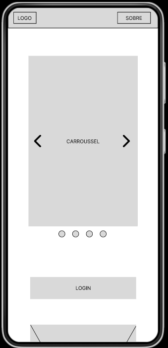&nbsp;

<sup>Fonte: Material produzido pelos autores (2024)</sup>

</div>


&nbsp;&nbsp;&nbsp;&nbsp;&nbsp;&nbsp;Tela de início parte 1: Primeira tela que o usuário terá contato ao entrar no site, onde visualizará informações do site e da pesquisa para poder ir até a tela de login, essa tela tem opção de rolagem para ver mais informações da aplicação. 

&nbsp;&nbsp;&nbsp;&nbsp;&nbsp;&nbsp;Esse Wireframe está associado ao <a href ="#us">US 02</a> (User Story 02) da seção 2.3, de acordo com o critério de aceite 2.


<br>

<div align="center">

<sub>Figura 14 - Tela de Início - Parte 2</sub>

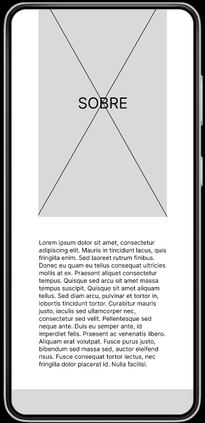&nbsp;

<sup>Fonte: Material produzido pelos autores (2024)</sup>

</div>


&nbsp;&nbsp;&nbsp;&nbsp;&nbsp;&nbsp;Tela de início parte 2: Essa é a continuação da tela de início após rolar a tela mostrando mais informações sobre o projeto.

&nbsp;&nbsp;&nbsp;&nbsp;&nbsp;&nbsp;Esse Wireframe está associado ao <a href ="#us">US 02</a>(User Story 02) da seção 2.3, de acordo com o critério de aceite 2.


<br>

<div align="center">

<sub>Figura 15 - Tela de Login</sub>

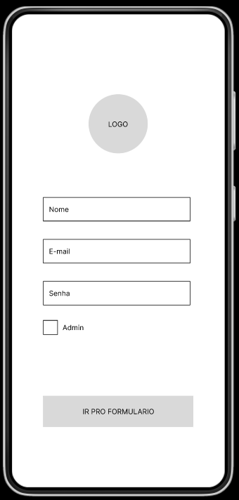&nbsp;

<sup>Fonte: Material produzido pelos autores (2024)</sup>

</div>


&nbsp;&nbsp;&nbsp;&nbsp;&nbsp;&nbsp;Tela de login: Segunda tela, onde o usuário poderá inserir dados para poder acessar o formulário.

&nbsp;&nbsp;&nbsp;&nbsp;&nbsp;&nbsp;Esse Wireframe está associado ao <a href ="#us">US 03</a> (User Story 03) da seção 2.3, de acordo com o critério de aceite 2.


<br>

<div align="center">

<sub>Figura 16 - Tela de formulário - Parte 1</sub>

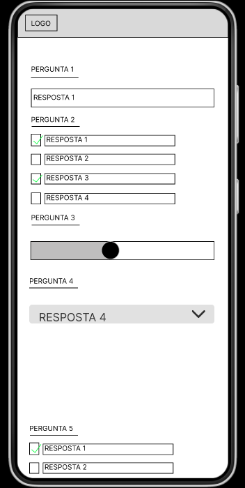&nbsp;

<sup>Fonte: Material produzido pelos autores (2024)</sup>

</div>


&nbsp;&nbsp;&nbsp;&nbsp;&nbsp;&nbsp;Tela de formulário parte 1: Terceira tela na qual apresentará as perguntas do formulário para o usuário. Essa é 1 das 4 telas de formulário que o site terá.

&nbsp;&nbsp;&nbsp;&nbsp;&nbsp;&nbsp;Esse Wireframe está associado ao <a href ="#us">US 01</a>(User Story 03) da seção 2.3, de acordo com o critério de aceite 1.


<br>

<div align="center">

<sub>Figura 17 - Tela de Formulário - Parte 2</sub>

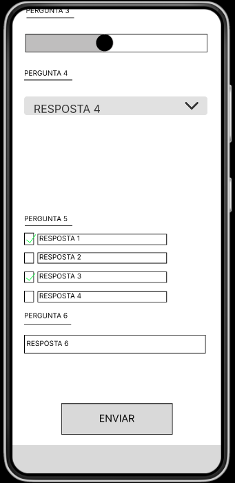&nbsp;

<sup>Fonte: Material produzido pelos autores (2024)</sup>

</div>


&nbsp;&nbsp;&nbsp;&nbsp;&nbsp;&nbsp;Tela de formulário parte 2: Essa é a continuação da tela de formulário após rolar a tela, mostrando mais perguntas com respostas diferentes e dinâmicas.

&nbsp;&nbsp;&nbsp;&nbsp;&nbsp;&nbsp;Esse Wireframe está associado ao <a name="us">US 01</a> (User Story 03) da seção 2.3, de acordo com o critério de aceite 1.


<br>

<div align="center">

<sub>Figura 18 - Tela do Administrador</sub>

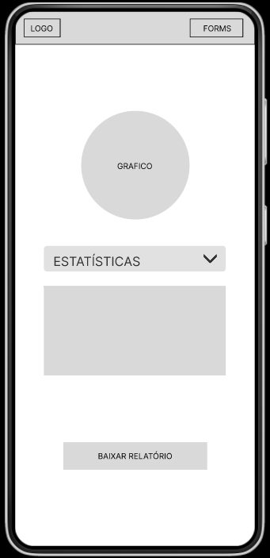&nbsp;

<sup>Fonte: Material produzido pelos autores (2024)</sup>

</div>


&nbsp;&nbsp;&nbsp;&nbsp;&nbsp;&nbsp;Tela do Administrador: Quarta tela, onde será as informações sobre estatísticas para o administrador e baixar o relatório sobre as pesquisas.

&nbsp;&nbsp;&nbsp;&nbsp;&nbsp;&nbsp;Esse Wireframe está associado ao <a href ="#us">US 03</a> (User Story 03) da seção 2.3, de acordo com o critério de aceite 1.


<br>

<div align="center">

<sub>Figura 19 - Tela de Finalização</sub>

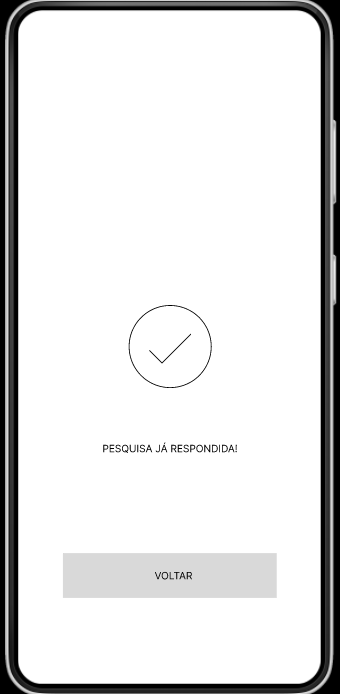&nbsp;

<sup>Fonte: Material produzido pelos autores (2024)</sup>

</div>


&nbsp;&nbsp;&nbsp;&nbsp;&nbsp;&nbsp;Tela de finalização: Quinta tela que aparece após ter concluído o formulário.

&nbsp;&nbsp;&nbsp;&nbsp;&nbsp;&nbsp;Esse Wireframe está associado ao <a href ="#us">US 03</a>    (User Story 03) da seção 2.3, de acordo com o critério de aceite 1.


<br>

<div align="center">
&nbsp;&nbsp;&nbsp;&nbsp;&nbsp;&nbsp;<strong>Abaixo, segue modelos de Wireframes Desktop de média fidelidade do produto a ser desenvolvido em ordem de fluxo (Figura 20 a 27):</strong>
</div>
</br>

<div align="center">
<sub>Figura 20 - Tela de Início - Parte 1</sub>
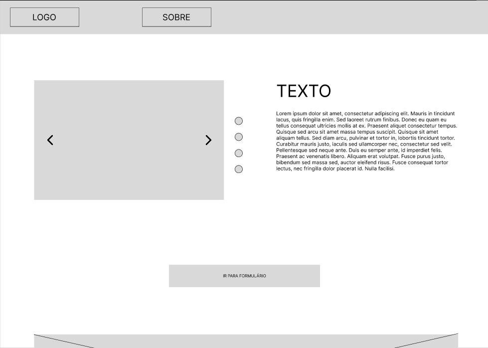&nbsp;
<sup>Fonte: Material produzido pelos autores (2024)</sup>
</div>


&nbsp;&nbsp;&nbsp;&nbsp;&nbsp;&nbsp;Tela de início parte 1: Primeira tela que o usuário terá contato ao entrar no site, onde visualizará informações do site e da pesquisa para poder ir até a tela de login.

&nbsp;&nbsp;&nbsp;&nbsp;&nbsp;&nbsp;Esse Wireframe está associado ao <a href ="#us">US 02</a> (User Story 02) da seção 2.3, de acordo com o critério de aceite 2.


<br>

<div align="center">
<sub>Figura 21 - Tela de Início - Parte 2</sub>
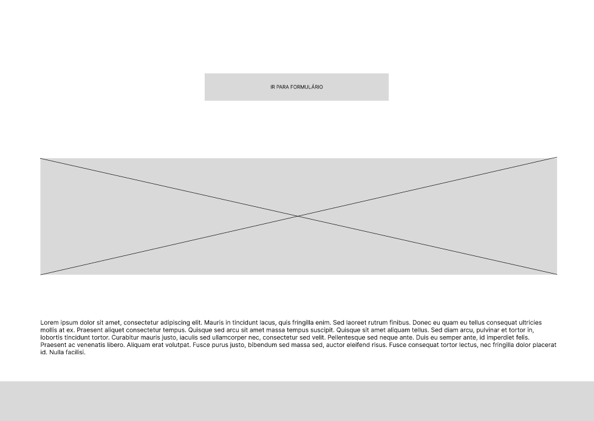&nbsp;
<sup>Fonte: Material produzido pelos autores (2024)</sup>
</div>


&nbsp;&nbsp;&nbsp;&nbsp;&nbsp;&nbsp;Tela de início parte 2: Essa é a continuação da tela de início após rolar a tela mostrando mais informações sobre o projeto.

&nbsp;&nbsp;&nbsp;&nbsp;&nbsp;&nbsp;Esse Wireframe está associado ao <a href ="#us">US 03</a> (User Story 03) da seção 2.3, de acordo com o critério de aceite 2.


<br>
<div align="center">
<sub>Figura 22 - Tela de Login</sub>
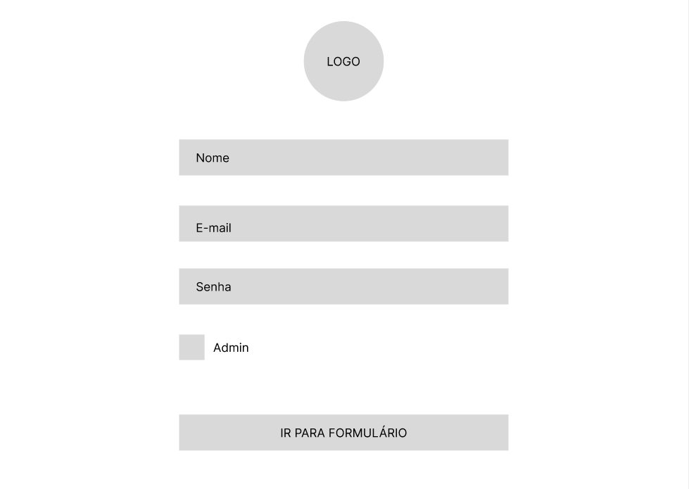&nbsp;
<sup>Fonte: Material produzido pelos autores (2024)</sup>
</div>


&nbsp;&nbsp;&nbsp;&nbsp;&nbsp;&nbsp;Tela de login: Segunda tela, onde o usuário poderá inserir dados para poder acessar o formulário.

&nbsp;&nbsp;&nbsp;&nbsp;&nbsp;&nbsp;Esse Wireframe está associado ao <a href ="#us">US 03</a> (User Story 03) da seção 2.3, de acordo com o critério de aceite 2.


<br>


<div align="center">
<sub>Figura 23 - Tela de formulário - Parte 1</sub>
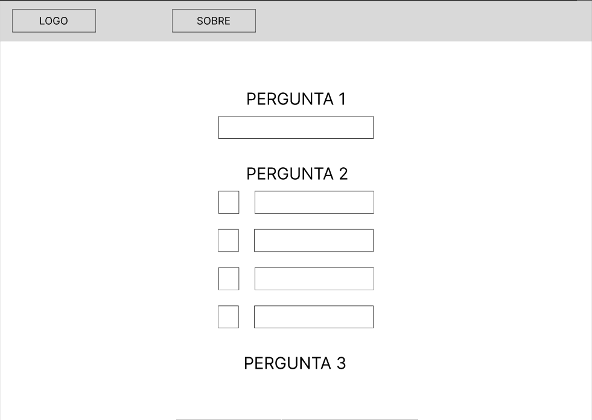&nbsp;
<sup>Fonte: Material produzido pelos autores (2024)</sup>
</div>


&nbsp;&nbsp;&nbsp;&nbsp;&nbsp;&nbsp;Tela de formulário parte 1: Terceira tela na qual apresentará as perguntas do formulário para o usuário. Essa é 1 das 4 telas de formulário que o site terá.

&nbsp;&nbsp;&nbsp;&nbsp;&nbsp;&nbsp;Esse Wireframe está associado ao <a href ="#us">US 01</a> (User Story 03) da seção 2.3, de acordo com o critério de aceite 1.


<br>

<div align="center">
<sub>Figura 24 - Tela de Formulário - Parte 2</sub>
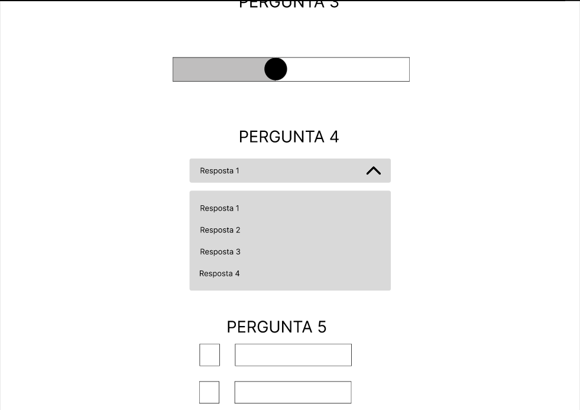&nbsp;
<sup>Fonte: Material produzido pelos autores (2024)</sup>
</div>

&nbsp;&nbsp;&nbsp;&nbsp;&nbsp;&nbsp;Tela de formulário parte 2: Essa é a continuação da tela de formulário após rolar a tela, mostrando mais perguntas com respostas diferentes e dinâmicas.

&nbsp;&nbsp;&nbsp;&nbsp;&nbsp;&nbsp;Esse Wireframe está associado ao <a href ="#us">US 01</a>(User Story 03) da seção 2.3, de acordo com o critério de aceite 1.


<br>

<div align="center">
<sub>Figura 25 - Tela de Formulário - Parte 3</sub>
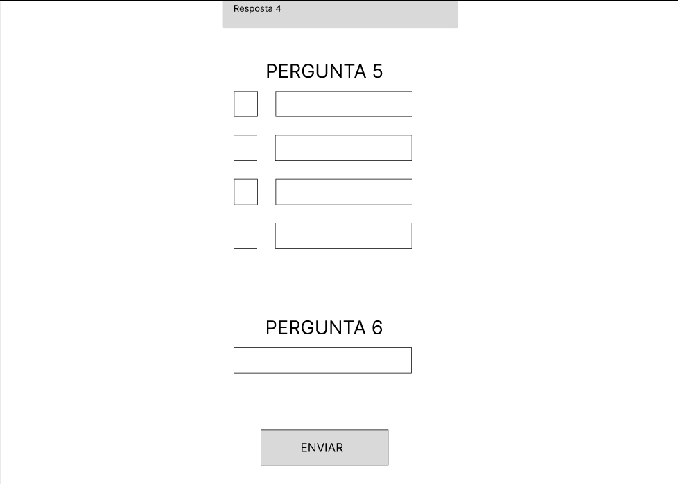&nbsp;
<sup>Fonte: Material produzido pelos autores (2024)</sup>
</div>

&nbsp;&nbsp;&nbsp;&nbsp;&nbsp;&nbsp;Tela de formulário parte 3: Essa é a continuação da tela de formulário após rolar a tela, mostrando mais perguntas com respostas diferentes e dinâmicas.

&nbsp;&nbsp;&nbsp;&nbsp;&nbsp;&nbsp;Esse Wireframe está associado ao <a href ="#us">US 01</a> (User Story 03) da seção 2.3, de acordo com o critério de aceite 1.


<br>

<div align="center">
<sub>Figura 26 - Tela do Administrador</sub>
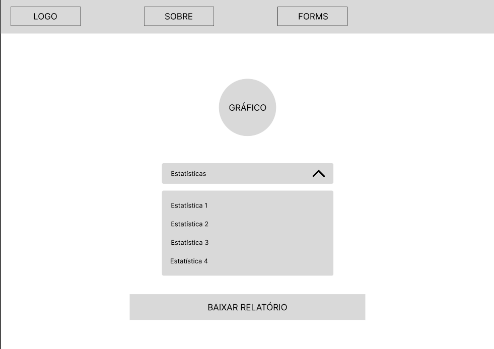&nbsp;
<sup>Fonte: Material produzido pelos autores (2024)</sup>
</div>


&nbsp;&nbsp;&nbsp;&nbsp;&nbsp;&nbsp;Tela do Administrador: Quarta tela, onde será as informações sobre estatísticas para o administrador e baixar o relatório sobre as pesquisas.

&nbsp;&nbsp;&nbsp;&nbsp;&nbsp;&nbsp;Esse Wireframe está associado ao <a href ="#us">US 03</a> (User Story 03) da seção 2.3, de acordo com o critério de aceite 1.


<br>

<div align="center">
<sub>Figura 27 - Tela de Finalização</sub>
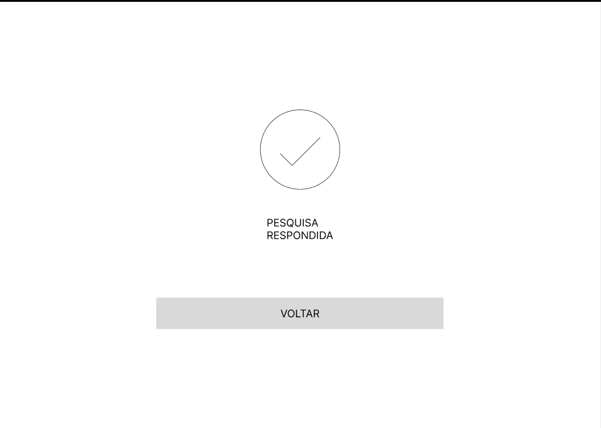&nbsp;
<sup>Fonte: Material produzido pelos autores (2024)</sup>
</div>

<div align="center">
Tela de finalização: Quinta tela que aparece após ter concluído o formulário. 
Esse Wireframe está associado ao <a href ="#us">US 03</a> (User Story 03) da seção 2.3, de acordo com o critério de aceite 1.
</div>
<br>


&nbsp;&nbsp;&nbsp;&nbsp;&nbsp;&nbsp;Portanto, os Wireframes são importantes ferramentas de desenvolvimento, pois facilitam a experimentação de novas possibilidades e a definição de funcionalidades pretendidas, auxiliando na visualização final do produto.


## 3.3. Guia de estilos 

&nbsp;&nbsp;&nbsp;&nbsp; Constantemente usado nas criações de aplicações Web, o guia de estilos é um documento indispensável, a qual abriga nele todos os recursos visuais do site, tais como as cores, tipografia e elementos ainda mais abrangentes como ícones e imagens. 


&nbsp;&nbsp;&nbsp;&nbsp;A importância de um guia de estilo está na sua capacidade de manter a consistência e coerência visual ao longo do tempo e em diferentes mídias. Ele ajuda a garantir que a instituição possa ser reconhecida de forma consistente pelo público-alvo, transmitindo uma mensagem visual que reforça a identidade e os valores do projeto. Além disso, um guia de estilo facilita o trabalho dos designers e profissionais de marketing, fornecendo um conjunto claro de diretrizes para orientar o desenvolvimento de novos materiais e garantir uma comunicação visual eficaz e unificada.


### 3.3.1 Cores

&nbsp;&nbsp;&nbsp;&nbsp; A escolha cuidadosa das cores desempenha um papel fundamental na criação de um design visualmente atraente e funcional. As cores são utilizadas para distinguir e realçar uma variedade de elementos, desde tópicos e seções até diferentes tipos de fontes e elementos gráficos. Ao atribuir cores estrategicamente, é possível facilitar a navegação e compreensão do conteúdo pelo usuário (Figura 28).

<div align="center">

<sub>Figura 28 - Lista de Cores</sub>

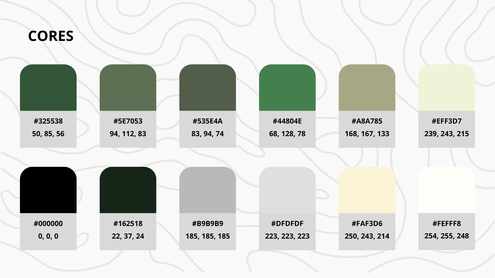&nbsp;
<sup>Fonte: Material produzido pelos autores (2024)</sup>
</div>

#325538 - Very dark desaturated lime green.<br>
#5E7053 - Very dark grayish green.
<br>
#535E4A - Very dark grayish green.
<br>
#44804E - Dark moderate lime green.
<br>
#A8A785 - Dark grayish yellow.
<br>
#EFF3D7 - Light grayish yellow.
<br>
#000000 - Black
<br>
#162518 - Very dark (mostly black) lime green.
<br>
#B9B9B9 - Gray.
<br>
#DFDFDF - Very light gray.
<br>
#FEFFF8 - Very pale (mostly white) yellow.
<br>
#FAF3D6 - Light grayish yellow.

&nbsp;&nbsp;&nbsp;&nbsp; Dessa forma, durante a escolha das cores, foi aplicado diversos conceitos e representações que se associavam ao projeto, isso é, a iniciativa Abandono Zero, trazendo consigo uma ação de conscientização. O objetivo da causa é auxiliar pesquisadores a entenderem os motivos por trás de abandonos, nessa perspectiva, a seleção das cores foi realizada para que o site seja amigável porém conscientizador, assim fazendo com que o usuário se sinta tocado pela iniciativa. Dessa maneira, da paleta de cores selecionada, é possível dividi-la em 3 principais tópicos:

- **Cor para o background**:
	#FEFFF8
Essa cor compõe o fundo do site, fazendo com que deixe claro a padronização, e um tom suave para leitura e interação com outros elementos do site.

- **Cores responsáveis por diversos elementos**:
#325538, #57E053, #A8A785, #44804E, #FAF3D6, #535E4A, B9B9B9, #DFDFDF e #EFF3D7
Usadas em diversos elementos do site, como secções, botões e fontes, essas cores ocupam um espaço muito importante na aplicação.

- **Cor da fonte principal e ícones**: 
	#162518 e #000000
Compondo a cor da grande maioria das fontes usadas no site, essas duas cores são aplicadas constantemente para que a leitura seja clara e concisa, e elementos não fiquem sem falta de contraste.


### 3.3.2 Tipografia

&nbsp;&nbsp;&nbsp;&nbsp; A seleção apropriada das fontes também é crucial para a eficácia do design. As fontes desempenham um papel essencial na comunicação da personalidade e da marca, além de influenciar a legibilidade e a usabilidade do conteúdo. Fontes adequadas podem transmitir uma sensação de profissionalismo, elegância ou modernidade, enquanto fontes inadequadas podem comprometer a clareza e a credibilidade da mensagem. Portanto, ao desenvolver um design, é essencial considerar não apenas as cores e as fontes individualmente, mas também como elas interagem e complementam umas às outras para criar uma experiência visual coesa e agradável.

&nbsp;&nbsp;&nbsp;&nbsp; Conforme o desenvolvimento do guia de estilos, e refletindo sobre os conceitos a serem considerados, foi decidido 3 principais fontes para a aplicação Web, elas são (Figura 29):

<div align="center">

<sub>Figura 29 - Tipografia</sub>

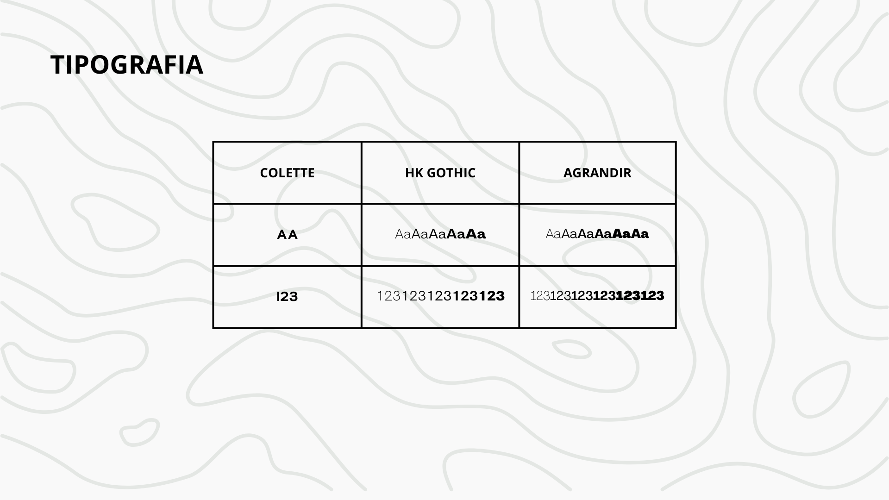&nbsp;
<sup>Fonte: Material produzido pelos autores (2024)</sup>
</div>

-**Agrandir**:
Essa fonte é responsável por compor a maioria dos textos do site, fazendo com que a leitura não fique cansativa para o usuário. Suas aplicações dentro do projeto envolvem textos mais longos, perguntas ao usuário.

-**HK Gothic**:
Considerada uma fonte de destaque, com traços mais robustos, a HK Gothic é encarregada de compor os textos da Navbar, e outros tipos de botões de acesso.

-**COLETTE**:
Já a COLETTE, tem o papel de representar títulos e avisos da aplicação, fazendo ter uma função de levar o usuário a ter mais atenção nos trechos onde essa fonte é aplicada. Suas composições na aplicação envolvem títulos e outros textos que requerem que o usuário tenha mais foco.


### 3.3.3 Iconografia e imagens 

&nbsp;&nbsp;&nbsp;&nbsp; Usados para garantir consistência visual, ao escolher cuidadosamente a ícones e imagens, é possível comunicar efetivamente, criar uma estética atraente, promover a acessibilidade e diferenciar a marca.

&nbsp;&nbsp;&nbsp;&nbsp; Nessa perspectiva, foi selecionado cuidadosamente alguns ícones e imagens para que permita ao usuário a se localizar no site por meio de associações (Figura 30).

<div align="center">

<sub>Figura 30 - Lista de icones e imagens</sub>

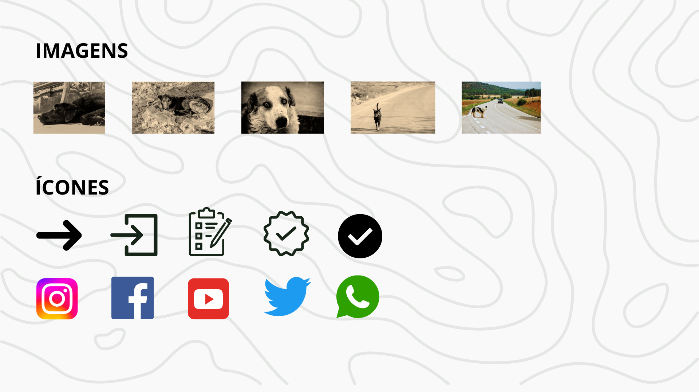&nbsp;
<sup>Fonte: Material produzido pelos autores (2024)</sup>
</div>

-**Imagens** 
Tais imagens foram escolhidas pois trazem diferentes sentimentos ao usuário, e levando uma imersão maior com a causa, fazendo com que traga-o a interagir mais com o site e possivelmente responder o formulário.

-**Ícones**
Já os ícones escolhidos, trazem diferentes tipos de associação para o usuário se localizar e compreender melhor site. O ícone de seta, guia o usuário a representar um passo a passo de como certas ações devem ser aplicadas. Para melhor orientação, os ícones de login, formulário e feito, representam o caminho padrão do usuário para seguir com os formulários, assim como o outro ícone de concluido, que representa a conclusão do formulário. Por fim os ícones de redes sociais, tem a função de conduzir aos outros métodos de contato com a equipe do Abandono Zero.


&nbsp;&nbsp;&nbsp;&nbsp;Portanto, o guia de estilos representa um fator de extrema importância no desenvolvimento de aplicações web, oferecendo uma base sólida para a consistência visual e a comunicação eficaz. Ao incluir elementos cruciais como cores, tipografia, ícones e imagens, ele não apenas garante uma identidade visual clara, mas também promove a acessibilidade e diferenciação da marca. Portanto, é indispensável para orientar o design e a experiência do usuário, tornando-se uma ferramenta essencial para equipes de desenvolvimento e design.
de aplicação, utilizadas na solução

## 3.4 Protótipo de alta fidelidade (sprints 2 e 3)

&nbsp;&nbsp;&nbsp;&nbsp;O Protótipo de Alta Fidelidade é uma representação visual detalhada e interativa do produto final, que inclui todos os elementos visuais, como cores, tipografia, imagens e interações. Este protótipo permite aos usuários e stakeholders experimentar o produto como se estivesse completo, facilitando a identificação de problemas de usabilidade e a validação de soluções de design antes da fase de desenvolvimento. Diferente do wireframe, que foca na estrutura e funcionalidade, o protótipo de alta fidelidade também considera a experiência do usuário (UX) e a interface do usuário (UI), oferecendo uma visão realista do produto final.

&nbsp;&nbsp;&nbsp;&nbsp;Existem várias ferramentas disponíveis para a criação de protótipos de alta fidelidade, como Sketch, Figma e Adobe XD, que permitem a criação de designs detalhados e a simulação de interações. Essas ferramentas também facilitam a colaboração entre designers, desenvolvedores e stakeholders, permitindo comentários e revisões em tempo real.

&nbsp;&nbsp;&nbsp;&nbsp;O desenvolvimento de um protótipo de alta fidelidade envolve várias etapas, incluindo a definição de requisitos, a criação de wireframes, o design da interface do usuário, a implementação de interações e a realização de testes de usabilidade. Este processo iterativo garante que o produto final atenda às expectativas dos usuários e às metas do projeto.

&nbsp;&nbsp;&nbsp;&nbsp;No contexto do projeto mobile first, o protótipo de alta fidelidade é desenvolvido inicialmente para dispositivos móveis, considerando as limitações e oportunidades específicas desses dispositivos, como tamanho de tela e interações por toque. Após a validação do design para mobile, adaptações são feitas para garantir uma experiência otimizada também em desktops e outras plataformas.


&nbsp;&nbsp;&nbsp;&nbsp;Assim, em perspectiva de todos os conceitos de User Experience e User Interface, segue abaixo o um pouco do protótipo de alta fidelidade desenvolvido (Figuras 31 a 39) pensando nas motivações do projeto e conceitos aprendidos neste módulo e usando a ferramenta [Figma](https://www.figma.com/about/), o qual pode ser acessado através deste [link](https://www.figma.com/design/a1rammIufjkYdori19LOuE/P.A.F?node-id=0-1&t=eGr22UISuoByNblb-0).

<div align="center">

<sub>Figura 31 - Página inicial do Site Abandono Zero</sub>

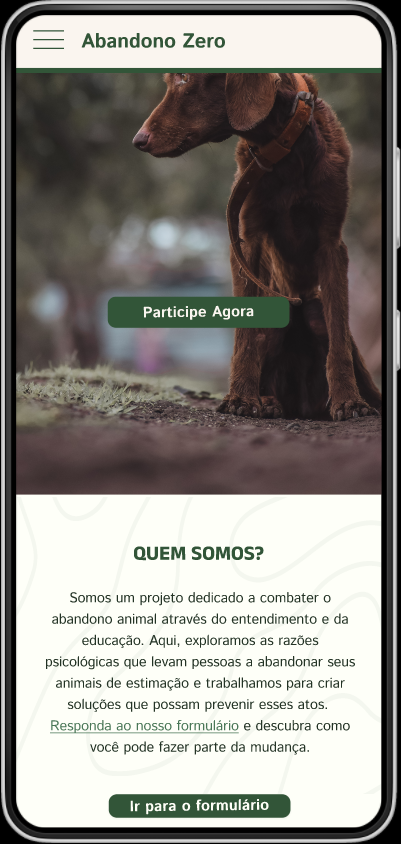

<sup>Fonte: Material produzido pelos autores (2024)</sup>
</div>

&nbsp;&nbsp;&nbsp;&nbsp;Seguindo os conceitos definidos na criação da aplicação, uma das principais definições era de conscientizar o usuário ao longo da navegação do site. Dessa forma, utilizamos de imagens e texto que fazem com que o usuário se apegue a causa e se sinta ainda mais motivado a responder os formulários.

<div align="center">

<sub>Figura 32 - Continuação da página inicial do Site Abandono Zero</sub>

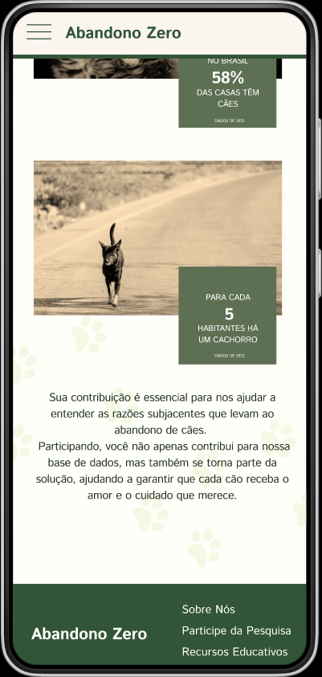

<sup>Fonte: Material produzido pelos autores (2024)</sup>
</div>

&nbsp;&nbsp;&nbsp;&nbsp;Ainda em consideração aos conceitos anteriores, outros dois textos são introduzidos pensando em conscientização do usuário, e um botão o-guiando ao formulário.

<div align="center">

<sub>Figura 33 - Tela de login do Site Abandono Zero</sub>

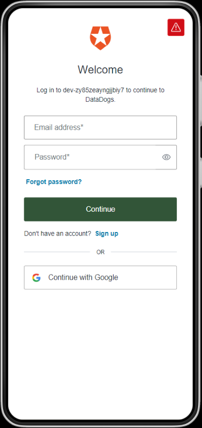

<sup>Fonte: Material produzido pelos autores (2024)</sup>
</div>

<div align="center">

<sub>Figura 34 - Tela de cadastro do Site Abandono Zero</sub>

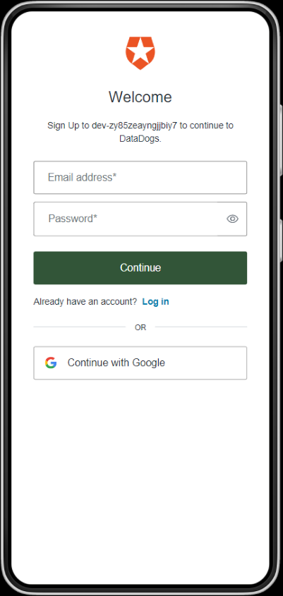

<sup>Fonte: Material produzido pelos autores (2024)</sup>
</div>

&nbsp;&nbsp;&nbsp;&nbsp;Ao apertar o botão de se direcionar ao formulário, o usuário, de acordo com o banco de dados, é possivelmente direcionado para duas páginas: Cadastre-se ou Login. As duas telas são intuitivas e de fácil compreensão para o usuário, permitindo que ele faça login e siga para o formulário sem dificuldades.

<div align="center">

<sub>Figura 35 - Tela de formulário do Site de Abandono Zero</sub>

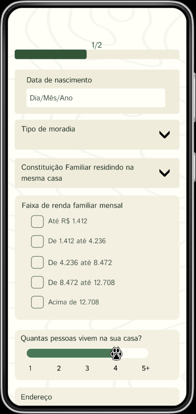

<sup>Fonte: Material produzido pelos autores (2024)</sup>
</div>

<div align="center">

<sub>Figura 36 - Dando continuidade a tela de formulário do Site Abandono Zero</sub>

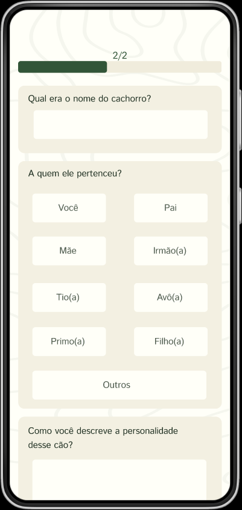

<sup>Fonte: Material produzido pelos autores (2024)</sup>
</div> 

<div align="center">

<sub>Figura 37 - Dando continuidade a tela de formulário do Site Abandono Zero

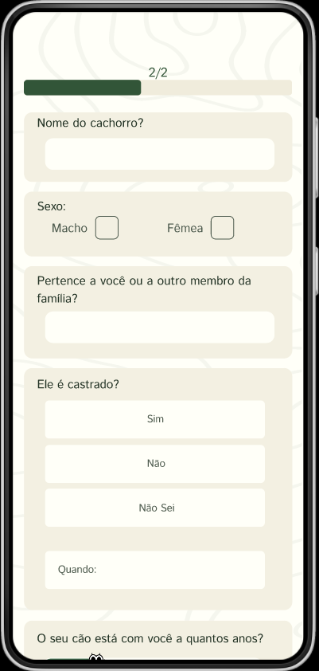

<sup>Fonte: Material produzido pelos autores (2024)</sup>
</div>

&nbsp;&nbsp;&nbsp;&nbsp;As perguntas desenvolvidas para o formulário, foram focadas em não deixar o usuário entediado enquanto responde, consequentemente garantindo com que sejam dinâmicas e rápidas.

<div align="center">

<sub>Figura 38 - Página de conclusão de respostas do Site Abandono Zero

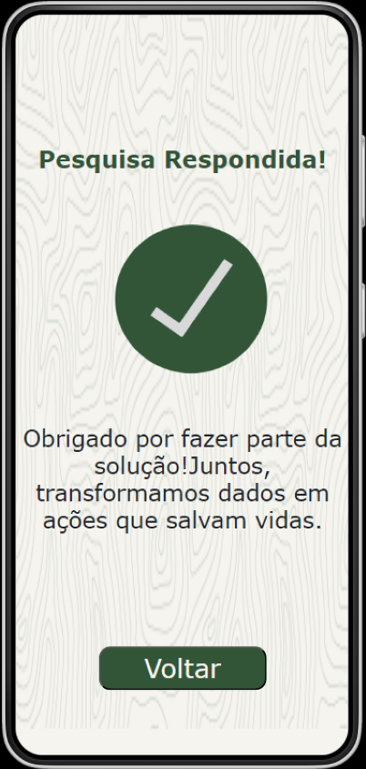

<sup>Fonte: Material produzido pelos autores (2024)</sup>
</div>


&nbsp;&nbsp;&nbsp;&nbsp;Para gerar um sentimento de jornada e conclusão no
site, foi desenvolvido uma página para que o usuário se sinta pertencido a causa (Figura 39 a 49).

<div align="center">

<sub>Figura 39 - Página de gráficos e informações

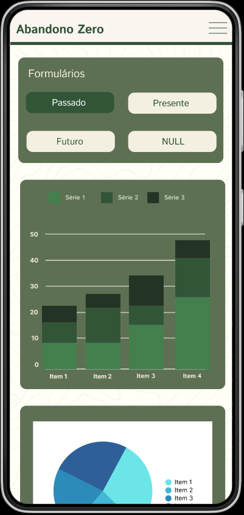

<sup>Fonte: Material produzido pelos autores (2024)</sup>
</div>


&nbsp;&nbsp;&nbsp;&nbsp;Disponível para administradores e pesquisadores, a página de estatísticas e gráficos possui diversos elementos gráficos e opções que permitem o usuário ter uma visão clara das informações, com fontes de cores que fazem o entendimento mais limpo e intuitivo.

&nbsp;&nbsp;&nbsp;&nbsp;Por último, apresentam-se as mesmas telas, porém na versão para computador com mudanças referentes a responsividade e alguns elementos extras na tela.

<div align="center">

<sub>Figura 40 - Página inicial do Site Abandono Zero</sub>

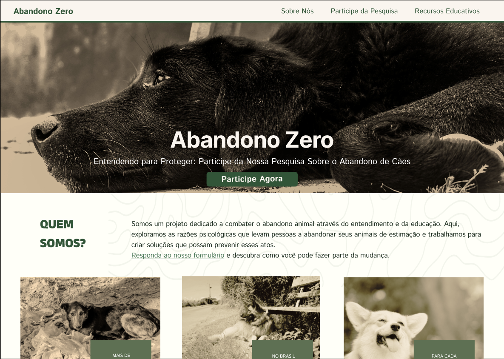

<sup>Fonte: Material produzido pelos autores (2024)</sup>
</div>

<div align="center">

<sub>Figura 41 - Tela de login do Site Abandono Zero</sub>


<sup>Fonte: Material produzido pelos autores (2024)</sup>
</div>

<div align="center">

<sub>Figura 42 - Tela de cadastro do Site Abandono Zero</sub>

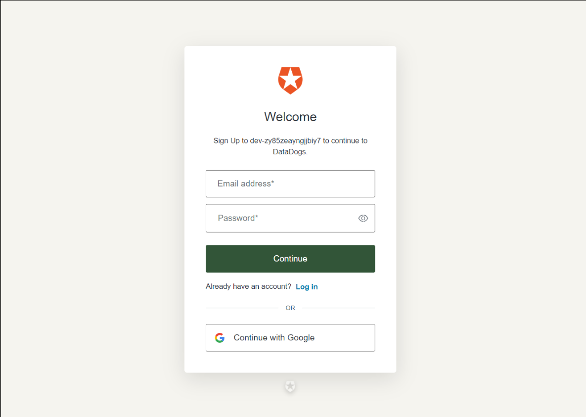

<sup>Fonte: Material produzido pelos autores (2024)</sup>
</div>

<div align="center">

<sub>Figura 43 - Tela de formulário do Site de Abandono Zero</sub>

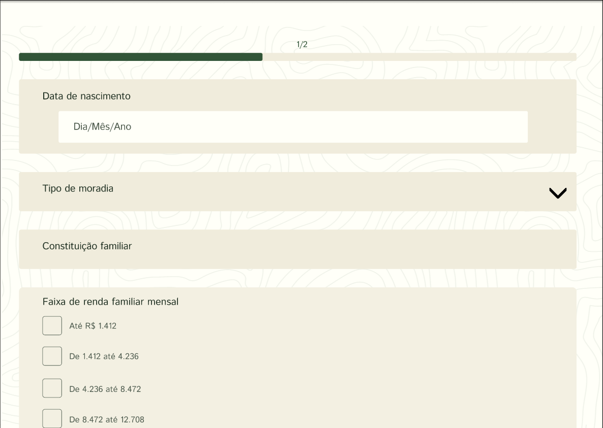

<sup>Fonte: Material produzido pelos autores (2024)</sup>
</div>

<div align="center">

<sub>Figura 44 - Tela de formulário do Site de Abandono Zero 2</sub>

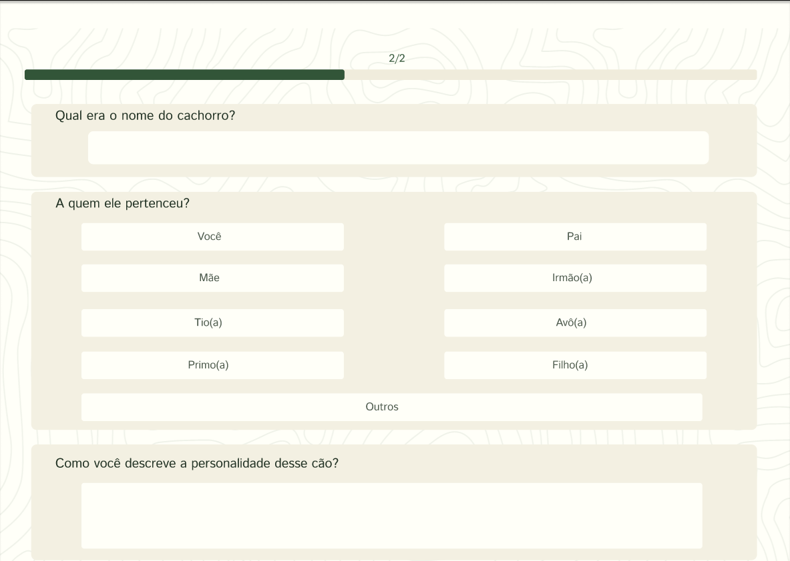

<sup>Fonte: Material produzido pelos autores (2024)</sup>
</div>

<div align="center">

<sub>Figura 45 - Tela de formulário do Site de Abandono Zero 3</sub>


<sup>Fonte: Material produzido pelos autores (2024)</sup>
</div>

<div align="center">

<sub>Figura 46 - Tela de formulário do Site de Abandono Zero 4</sub>

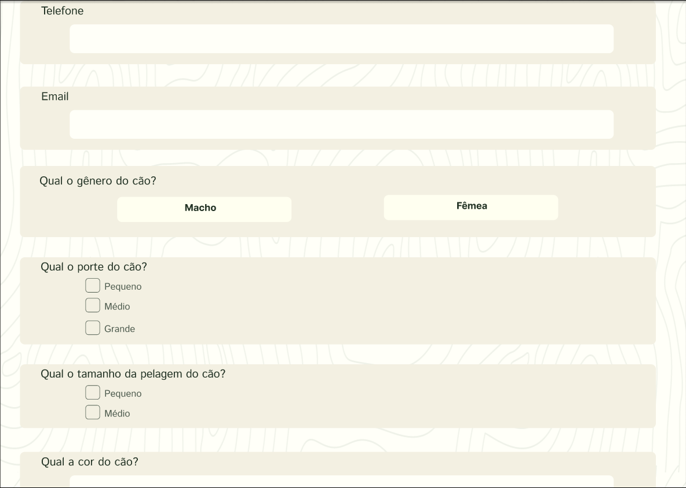

<sup>Fonte: Material produzido pelos autores (2024)</sup>
</div>

<div align="center">

<sub>Figura 47 - Tela de formulário do Site de Abandono Zero 5</sub>

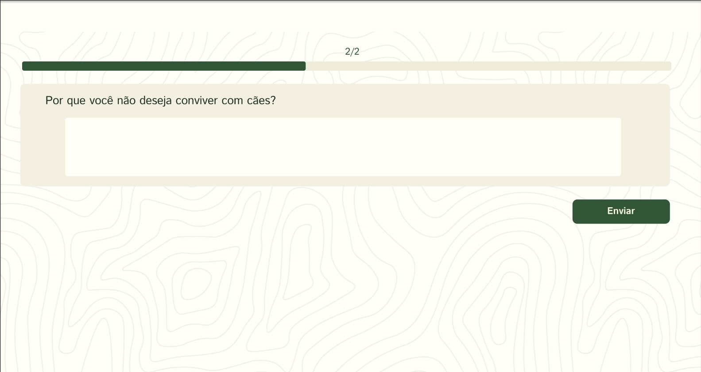

<sup>Fonte: Material produzido pelos autores (2024)</sup>
</div>

<div align="center">

<sub>Figura 48 - Página de gráficos e informações

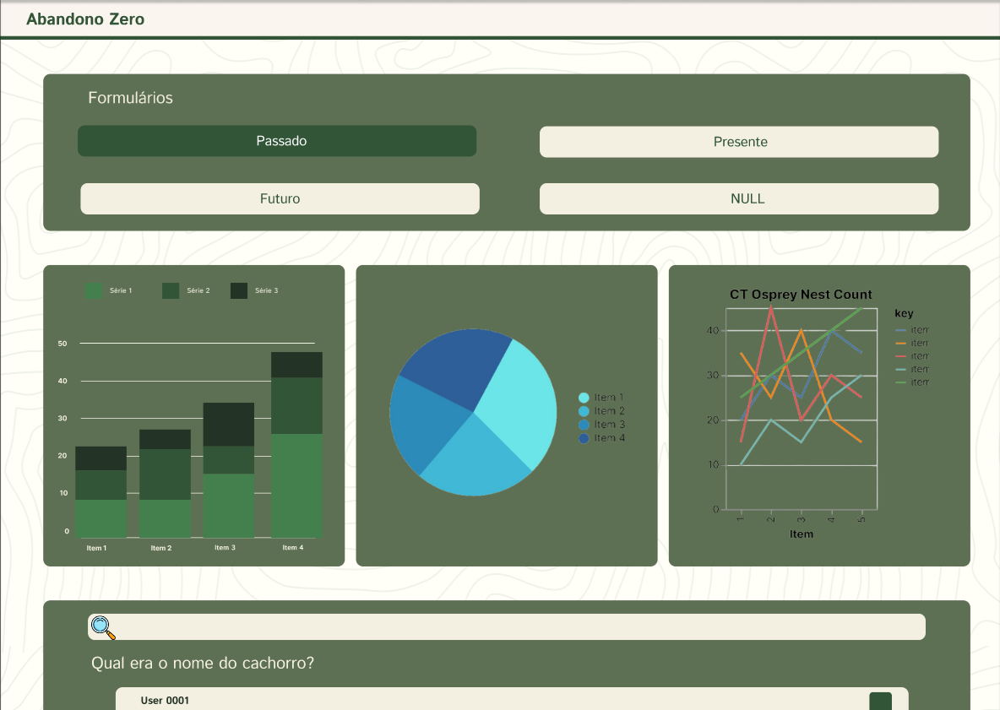

<sup>Fonte: Material produzido pelos autores (2024)</sup>
</div>

<div align="center">

<sub>Figura 49 - Página de conclusão de respostas do Site Abandono Zero


<sup>Fonte: Material produzido pelos autores (2024)</sup>

</div>

&nbsp;&nbsp;&nbsp;&nbsp;Entender como as páginas (Figura 50) se conectam é crucial para compreender o percurso do usuário pelo site. Isso nos permite avaliar a fluidez da experiência oferecida pela aplicação. Devido à simplicidade do nosso site, precisamos de poucas telas, o que resulta em uma navegação intuitiva e acessível, especialmente para usuários menos familiarizados com a tecnologia, minimizando o risco de desistência durante a pesquisa.

<div align="center">

<sub>Figura 50 - Fluxo entre imagens
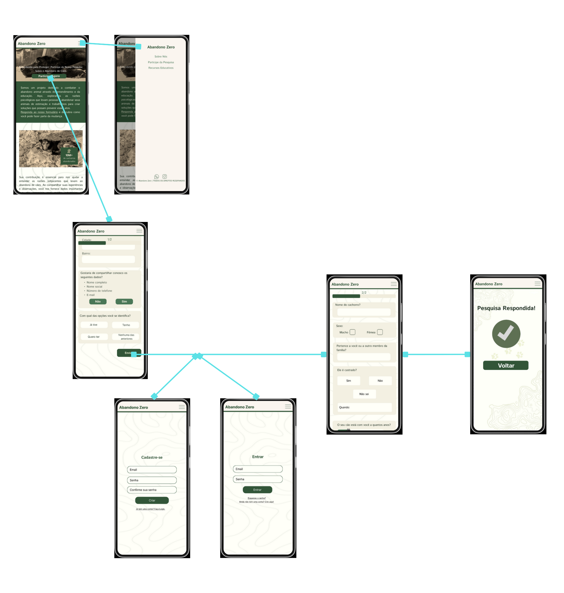

<sup>Fonte: Material produzido pelos autores (2024)</sup>
</div>

&nbsp;&nbsp;&nbsp;&nbsp;Portanto, ao integrar elementos que motivam e conscientizam os usuários, juntamente com uma interface intuitiva e direta, o protótipo de alta fidelidade contribui para uma experiência de usuário aprimorada, facilitando o acesso aos formulários e garantindo uma navegação sem complicações.


## 3.5. Modelagem do banco de dados 

### 3.5.1. Modelo Relacional 

&nbsp;&nbsp;&nbsp;&nbsp;&nbsp;&nbsp;A modelagem relacional é um conceito fundamental na ciência da computação, especificamente na área de bancos de dados. Ela se baseia em organizar os dados em tabelas, onde cada tabela representa uma entidade distinta e as relações entre essas entidades são estabelecidas por meio de chaves primárias e estrangeiras. Este modelo é amplamente utilizado em sistemas de gerenciamento de banco de dados relacionais (SGBD), como MySQL, PostgreSQL, Oracle, entre outros, devido à sua eficiência e flexibilidade.

&nbsp;&nbsp;&nbsp;&nbsp;&nbsp;&nbsp;No contexto do nosso projeto está sendo utilizado o sistema PostgreSQL, no qual a modelagem relacional é aplicada para criar um sistema robusto e escalável que gerencia informações sobre usuários e seus cães. O modelo relacional permite que cada entidade (usuário, cão atual, cão desejado ou não quero ter cão) seja representada por uma tabela separada, com relações claras entre elas. Isso facilita a inserção, atualização e recuperação de dados, além de garantir a integridade dos mesmos.

&nbsp;&nbsp;&nbsp;&nbsp;&nbsp;&nbsp;Com a modelagem relacional pronta, a próxima etapa é a implementação do modelo físico. O modelo físico é a representação mais próxima da estrutura real do banco de dados, incluindo detalhes como a alocação de espaço em disco, a organização dos dados em armazenamento e a otimização para consultas. Este modelo é responsável por traduzir o modelo lógico (neste caso, o modelo relacional) em estruturas de armazenamento físico, garantindo que os dados sejam armazenados de forma eficiente e acessíveis de maneira rápida e segura. A implementação do modelo físico envolve a definição de índices, a escolha de tipos de dados específicos para otimização de espaço e a configuração de parâmetros de armazenamento para melhorar o desempenho das operações de banco de dados.

&nbsp;&nbsp;&nbsp;&nbsp;&nbsp;&nbsp;Abaixo encontra-se os dois arquivos para baixar, sobre a modelagem relacional e a física:

- [Modelagem Relacional](https://github.com/Inteli-College/2024-1B-T14-IN02-G03/blob/main/assets/arquivos_modelo_relacional/modelo_relacional.xml)
- [Modelagem Física](https://github.com/Inteli-College/2024-1B-T14-IN02-G03/blob/main/assets/arquivos_modelo_relacional/modelo_fisico.sql)

&nbsp;&nbsp;&nbsp;&nbsp;&nbsp;&nbsp;Abaixo encontra-se o diagrama do projeto (Figura 51):

<div align="center">
<sub>Figura 51 - Modelagem Relacional completa do projeto</sub>
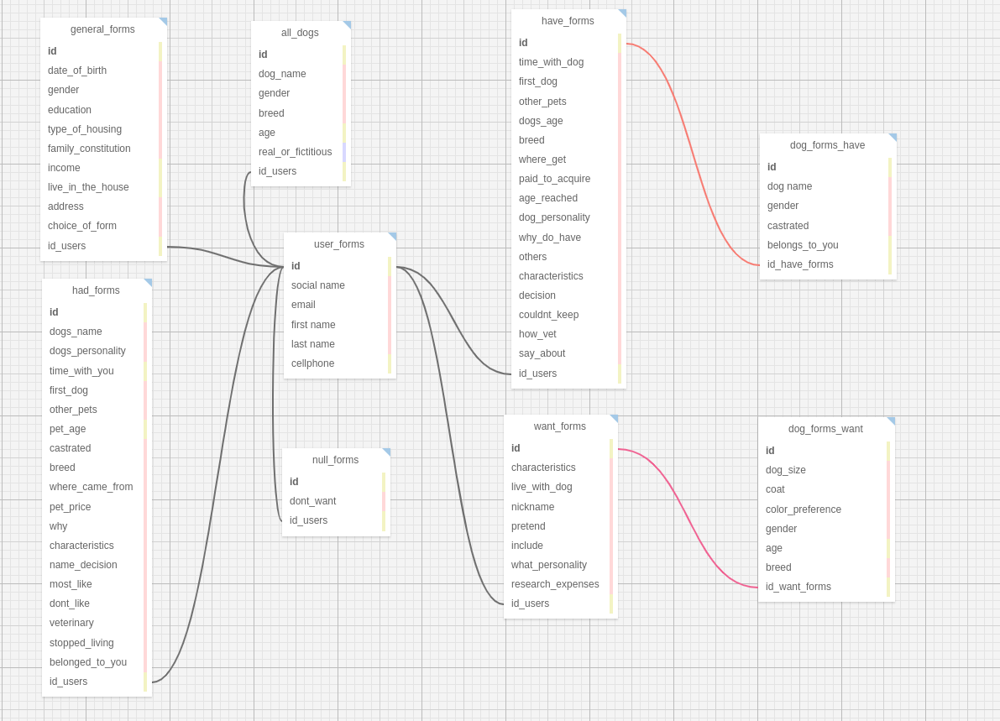&nbsp;
<sup>Fonte: Material produzido pelos autores (2024)</sup>
</div>

&nbsp;&nbsp;&nbsp;&nbsp;&nbsp;&nbsp;Este diagrama ilustra os relacionamentos entre as entidades do modelo relacional. Cada entidade é representada por um retângulo, e os relacionamentos são indicados por linhas conectando as entidades.

#### Tabelas e Relações

&nbsp;&nbsp;&nbsp;&nbsp;&nbsp;&nbsp;As tabelas definidas no projeto incluem:

- Tabela **general_forms**: Contém informações sobre formulários gerais, incluindo dados do usuário associado.
- Tabela **user_forms**: Armazena dados específicos do usuário, incluindo informações pessoais e de contato.
- Tabela **have_forms**: Contém informações sobre os cães dos usuários, incluindo personalidade, histórico e características.
- Tabela **dog_forms_have**: Armazena informações sobre os cães que os usuários possuem, incluindo detalhes específicos sobre cada animal.
- Tabela **had_forms**: Contém informações sobre cães que os usuários já tiveram, incluindo detalhes sobre cada período de posse.
- Tabela **want_forms**: Armazena informações sobre os cães que os usuários desejam ter, incluindo características desejadas e preferências.
- Tabela **null_forms**: Contém informações sobre o motivo do usuário não desejar ter cães.
- Tabela **dog_forms_want**: Armazena informações sobre os cães que os usuários desejam ter, incluindo detalhes específicos sobre cada animal.
- Tabela **all_dogs**: Armazena informações sobre todos os cães cadastrados no sistema.

&nbsp;&nbsp;&nbsp;&nbsp;&nbsp;&nbsp;Cada tabela está relacionada à tabela **users_forms** através da coluna `id_users`, permitindo a associação de informações de usuários com seus dados específicos nos outros sistemas. Isso demonstra a flexibilidade e a capacidade de modelagem relacional para representar complexas relações entre entidades.

#### Relacionamentos
- **users_forms**:
  - **general_forms**: Um usuário pode ter apenas um formulário geral (`1:1`). A chave estrangeira `id_users` na tabela general_forms agora é única para refletir essa relação.
  - **have_forms**: Um usuário pode ter vários formulários de cães que já possui (`1:N`).
  - **had_forms**: Um usuário pode ter vários formulários de cães que já teve (`1:N`).
  - **want_forms**: Um usuário pode ter vários formulários de cães que deseja adotar (`1:N`).
  - **null_forms**: Um usuário pode ter vários formulários de cães que nunca conviveu ou não tem vontade de ter (`1:N`).

- **general_forms**:
  - Relacionado diretamente com `user_forms` através da chave estrangeira `id_users`.

- **have_forms**:
  - Relacionado diretamente com `user_forms` através da chave estrangeira `id_users`.
  - Relacionado com `user_forms` através da chave estrangeira `id_have_forms`.
  - Relacionado com `dog_forms_have` através da chave estrangeira `id_have_forms`.

- **had_forms**:
  - Relacionado diretamente com `user_forms` através da chave estrangeira `id_users`.

- **want_forms**:
  - Relacionado diretamente com `user_forms` através da chave estrangeira `id_users`.

  - Relacionado com `dog_forms_want` através da chave estrangeira `id_want_forms`.

- **null_forms**:
  - Relacionado diretamente com `user_forms` através da chave estrangeira `id_users`.

- **dog_forms_have**:
  - Relacionado com `have_forms` através da chave estrangeira `id_have_forms`.

- **dog_forms_want**:
  - Relacionado com `want_forms` através da chave estrangeira `id_want_forms`.

- **all_dogs**:
  - Relacionado com `user_forms` através da chave estrangeira `id_users`.


#### Diagrama de cada tabela 

1. **Tabela `general_forms`**
   - Identificação: `id` (chave primária)
   - Chave estrangeira: `id_users` referenciando `users_id`
   - Outras colunas: `age`, `gender`, `education`, `type_of_housing`, `family_constitution`, `income`, `live_in_the_house`, `address`, `choice_of_form`, `id_users` (relacionada com `user_forms`)
   - Descrição: Contém informações sobre o formulário geral, incluindo dados do usuário associado.
   
<div align="center">
<sub>Figura 53 - Modelagem general_forms</sub>
<br>
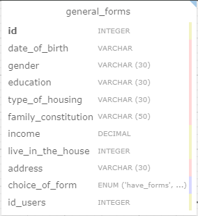&nbsp;
<br>
<sup>Fonte: Material produzido pelos autores (2024)</sup>
</div>

2. **Tabela `have_forms`**
   - Identificação: `id` (chave primária)
   - Chave estrangeira: `id_users` referenciando `users_id`
   - Outras colunas: `time_with_dog`, `first_dog`, `other_pets`, `dogs_age`, `breed`, `where_get`, `paid_to_acquire`, `age_reached`, `dog_personality`, `why_do_have`, `others`, `characteristics`, `decision`, `couldnt_keep`, `how_vet`, `say_about`, `id_users` (relacionada com `user_forms`)
   - Descrição: Contém informações sobre os cães dos usuários, incluindo personalidade, histórico e características.

<div align="center">
<sub>Figura 54 - Modelagem have_forms</sub>
<br>
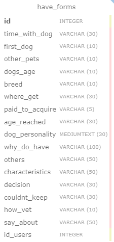&nbsp;
<br>
<sup>Fonte: Material produzido pelos autores (2024)</sup>
</div>

3. **Tabela `had_forms`**
   - Identificação: `id` (chave primária)
   - Chave estrangeira: `id_users` referenciando `users_id`
   - Outras colunas: `dogs_name`, `dogs_personality`, `time_with_you`, `first_dog`, `other_pets`, `pet_age`, `castrated`, `breed`, `where_came_from`, `pet_price`, `why`, `characteristics`, `name_decision`, `most_like`, `dont_like`, `veterinary`, `stopped_living`, `belonged_to_you`, `id_users` (relacionada com `user_forms`)
   - Descrição: Contém informações sobre cães que os usuários já tiveram, incluindo detalhes sobre cada período de posse.

<div align="center">
<sub>Figura 55 - Modelagem had_forms</sub>
<br>
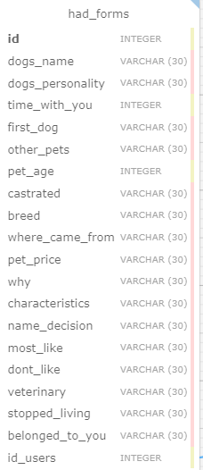&nbsp;
<br>
<sup>Fonte: Material produzido pelos autores (2024)</sup>
</div>

4. **Tabela `want_forms`**
   - Identificação: `id` (chave primária)
   - Chave estrangeira: `id_users` referenciando `users_id`
   - Outras colunas: `characteristics`, `live_with_dog`, `nickname`, `pretend`, `include`, `what_personality`, `research_expenses`, `id_users` (relacionada com `user_forms`)
   - Descrição: Armazena informações sobre os cães que os usuários desejam ter, incluindo características desejadas e preferências.

<div align="center">
<sub>Figura 56 - Modelagem want_forms</sub>
<br>
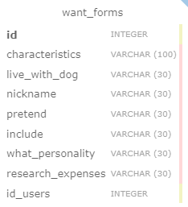&nbsp;
<br>
<sup>Fonte: Material produzido pelos autores (2024)</sup>
</div>

5. **Tabela `null_forms`**
   - Identificação: `id` (chave primária)
   - Chave estrangeira: `id_users` referenciando `users_id`
   - Outras colunas: `dont_want`, `id_users` (relacionada com `user_forms`)
   - Descrição: Contém informações sobre cães que os usuários não desejam ter.

<div align="center">
<sub>Figura 57 - Modelagem null_forms/sub>
<br>
&nbsp;
<br>
<sup>Fonte: Material produzido pelos autores (2024)</sup>
</div>

6. **Tabela `user_forms`**
   - Identificação: `id` (chave primária)
   - Outras colunas: `social_name`, `cellphone`, `email`, `first_name`, `last_name`, `id_users` 
   - Descrição: Armazena dados específicos do usuário, incluindo informações pessoais e de contato.

<div align="center">
<sub>Figura 58 - Modelagem users_forms</sub>
<br>
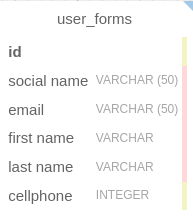&nbsp;
<br>
<sup>Fonte: Material produzido pelos autores (2024)</sup>
</div>

7. **Tabela `dog_forms_have`**
   - Identificação: `id` (chave primária)
   - Chave estrangeira: `id_users` referenciando `users_id`
   - Outras colunas: `dog_name`, `gender`, `castrated`, `belongs_to_you`, `id_have_forms` (relacionada com `have_forms`)
   - Descrição: Armazena informações sobre os cães que os usuários possuem, incluindo detalhes específicos sobre cada animal.

<div align="center">
<sub>Figura 59 - Modelagem dog_forms_have</sub>
<br>
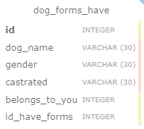&nbsp;<br>
<sup>Fonte: Material produzido pelos autores (2024)</sup>
</div>

8. **Tabela `dog_forms_want`**
   - Identificação: `id` (chave primária)
   - Chave estrangeira: `id_users` referenciando `users_id`
   - Outras colunas: `dog_size`, `coat`, `color_preference`, `gender`, `age`, `breed`, `id_want_forms` (relacionada com `want_forms`)
   - Descrição: Armazena informações sobre os cães que os usuários desejam ter, incluindo detalhes específicos sobre cada animal.

<div align="center">
<sub>Figura 60 - Modelagem dog_forms_want</sub>
<br>
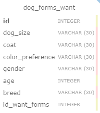&nbsp;
<br>
<sup>Fonte: Material produzido pelos autores (2024)</sup>
</div>

9 . **Tabela `all_dogs`**
   - Identificação: `id` (chave primária)
   - Chave estrangeira: `id_users` referenciando `users_id`
   - Outras colunas: `dog_name`, `gender`, `breed`, `age`, `real_or_fictitious`, `id_users` (relacionada com `user_forms`)
   - Descrição: Armazena informações sobre todos os cães cadastrados no site.

<div align="center">
<sub>Figura 61 - Modelagem dog_forms_want</sub>
<br>
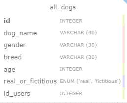&nbsp;
<br>
<sup>Fonte: Material produzido pelos autores (2024)</sup>
</div>

#### Explicações Adicionais

- **Relações**: As tabelas `general_forms`, `user_forms`, `have_forms`, `dog_forms_have`, `had_forms`, `want_forms`, `null_forms`,`all_dogs`, e `dog_forms_want` estão todas relacionadas à tabela `users` através da coluna `id_users`, permitindo a associação de informações de usuários com seus dados específicos nos outros sistemas.
- **Chaves Primárias**: Cada tabela tem uma chave primária (`id`), que identifica unicamente cada registro dentro da tabela.
- **Tipos de Dados**: As tabelas definidas no projeto utilizam uma variedade de tipos de dados para armazenar e gerenciar as informações necessárias. A escolha do tipo de dado adequado para cada coluna foi feito para garantir a eficiência, a precisão e a integridade dos dados. Abaixo, está detalhado os tipos de dados utilizados:

   - **INTEGER**: Utilizado para armazenar números inteiros. É ideal para identificadores únicos, como chaves primárias, ou para valores numéricos que não requerem casas decimais.

   - **VARCHAR**: Representa strings de caracteres variáveis. É útil para armazenar nomes, sobrenomes, endereços e qualquer outra informação textual que possa ter comprimento variável.

   - **DECIMAL**: Utilizado para armazenar números com casas decimais. É apropriado para valores monetários, medidas ou qualquer número que precise de precisão decimal.

   - **MEDIUMTEXT**: Um tipo de dado de texto que pode armazenar mais caracteres que o `varchar`. É ideal para campos que podem conter grandes quantidades de texto, como descrições detalhadas ou transcrições de texto longas.
   
   - **ENUM**: Um tipo de dado enumerado que representa um conjunto fixo de valores permitidos. É útil quando um campo só pode ter um conjunto específico de valores, como status de pedido (por exemplo, 'pendente', 'processando', 'completo'). O ENUM é uma escolha eficiente quando o conjunto de valores é limitado e bem definido.


&nbsp;&nbsp;&nbsp;&nbsp;&nbsp;&nbsp;A modelagem relacional é uma ferramenta poderosa para a organização e gestão de dados em sistemas de banco de dados. No nosso projeto, ela foi aplicada para criar um modelo de dados eficiente e escalável que atende às necessidades de gerenciar informações sobre usuários e seus cães. Através da definição clara de tabelas e relações, conseguimos garantir a integridade dos dados, facilitar consultas e manter a escalabilidade do sistema. A modelagem relacional, portanto, é essencial para o desenvolvimento de sistemas de banco de dados robustos e eficientes.


### 3.5.2. Consultas SQL e lógica proposicional 

&nbsp;&nbsp;&nbsp;&nbsp;&nbsp;&nbsp;A lógica proposicional em bancos de dados refere-se ao uso de princípios e operadores da lógica proposicional para a manipulação e consulta de informações armazenadas em um banco de dados. Esta aplicação da lógica é fundamental para a construção de consultas eficientes e precisas, a verificação da consistência de dados e o desenvolvimento de mecanismos de inferência.

&nbsp;&nbsp;&nbsp;&nbsp;&nbsp;&nbsp;Em resumo, a lógica proposicional desempenha um papel essencial em diversas áreas dos bancos de dados, desde a construção de consultas e verificação de integridade até a inferência lógica e otimização de consultas, sendo fundamental para o funcionamento eficiente e seguro dos sistemas de gerenciamento de bancos de dados.

&nbsp;&nbsp;&nbsp;&nbsp;&nbsp;&nbsp;Assim, segue abaixo 3 lógicas proposicionais sobre consultas SQL do banco de dados do projeto:

<div align="center">
<sub>Quadro 01 - Lógica Proposicional da consulta SQL para entender se o cachorro é castrado</sub>
</div>

Lógica Proposicional | 1.
--- | ---
Expressão SQL | <br>SELECT gender, castrated, belongs_to_you, owner_id<br>FROM dogs_forms_have<br>WHERE castrated = 'Sim' AND belongs_to_you = 1;
Proposições lógicas | **A**: O cachorro foi castrado (castrated = ‘Sim’).<br>**B**: belongs_to_you = 1.
Expressão lógica proposicional | A ∧ B
Tabela verdade:

| A | B | A ∧ B |
|---|---|-------|
|V  |V  |V      |
|V  |F  |F      |
|F  |V  |F      |
|F  |F  |F      |
<div align="center">
<sup>Fonte: Material produzido pelos autores (2024)</sup>
</div>

<br>

<div align="center">
<sub>Quadro 02 - Lógica Proposicional da consulta SQL para entender a escolha do formulário, do tipo de casa e a opção nula </sub>
</div>

Lógica Proposicional | 2.
--- | ---
Expressão SQL | SELECT gf.type_of_housing, gf.choice_of_form, nf.dont_want<br>FROM users u<br>WHERE (gf.choice_of_form = 'have' OR gf.type_of_housing = 'Apartamento')<br>AND (nf.dont_want IS NULL);
Proposições lógicas | **A**: A escolha de formulário se iguala a “tem” (gf.choice_of_form = 'have').<br>**B**: O tipo de casa é apartamento (gf.type_of_housing = 'Apartamento').<br>**C**: A opção de não quero é nula (nf.dont_want IS NULL).
Expressão lógica proposicional | (A ∨ B) ∧ C
Tabela verdade:

| A | B | C | (A ∨ B) | (A ∨ B) ∧ C |
|---|---|---|---------|-------------|
|V  |V  |V  |V        |V            |
|V  |V  |F  |V        |F            |
|V  |F  |V  |V        |V            |
|V  |F  |F  |V        |F            |
|F  |F  |F  |F        |F            |
|F  |V  |V  |V        |V            |
|F  |V  |F  |V        |F            |
|F  |F  |F  |V        |F            |

<div align="center">
<sup>Fonte: Material produzido pelos autores (2024)</sup>
</div>
<br>

<div align="center">
<sub>Quadro 02 - Lógica Proposicional da consulta SQL para entender se o cachorro é castrado, se não é o primeiro cachorro e a raça do cachorro </sub>
</div>

Lógica Proposicional | 3.
--- | ---
Expressão SQL | SELECT hf.first_dog, hf.castrated, hf.breed<br>FROM had_forms hf<br>WHERE (hf.castrated = 'Sim' OR hf.first_dog = 'Não')<br>AND (hf.breed = 'Labrador' OR hf.breed 'Beagle');
Proposições lógicas | **A**: O cachorro é castrado (hf.castrated = 'Sim')<br>**B**: Não é o primeiro cachorro (hf.first_dog = 'Não')<br>**C**: A raça do cachorro é um Labrador (hf.breed = 'Labrador')<br>**D**: A raça do cachorro é um Beagle (hf.breed 'Beagle')
Expressão lógica proposicional | (A ∨ B) ∧ (C ∨ D)
Tabela verdade:

| A | B | C | D | (A ∨ B) | (C ∨ D) | (A ∨ B) ∧ (C ∨ D) |
|---|---|---|---|---------|---------|-------------------|
|V  |V  |V  |V  |V        |V        |V                  |
|V  |V  |V  |F  |V        |V        |V                  |
|V  |V  |F  |V  |V        |V        |V                  |
|V  |V  |F  |F  |V        |F        |F                  |
|V  |F  |V  |V  |V        |V        |V                  |
|V  |F  |V  |F  |V        |V        |V                  |
|V  |F  |F  |V  |V        |V        |V                  |
|V  |F  |F  |F  |V        |F        |F                  |
|F  |V  |V  |V  |V        |V        |V                  |
|F  |V  |V  |F  |V        |V        |V                  |
|F  |V  |F  |V  |V        |V        |V                  |
|F  |V  |F  |F  |V        |V        |V                  |
|F  |F  |V  |V  |F        |V        |F                  |
|F  |F  |V  |F  |F        |V        |F                  |
|F  |F  |F  |V  |F        |V        |F                  |
|F  |F  |F  |F  |F        |F        |F                  |

<div align="center">
<sup>Fonte: Material produzido pelos autores (2024)</sup>
</div>
<br>

&nbsp;&nbsp;&nbsp;&nbsp;&nbsp;&nbsp;Em conclusão, a lógica proposicional é um componente vital para o funcionamento eficaz de SQL, influenciando desde a construção de consultas e a verificação de integridade dos dados até a otimização de operações e a segurança do sistema. A compreensão e a aplicação adequada dos princípios da lógica proposicional em SQL são essenciais para o gerenciamento eficiente e seguro de bancos de dados relacionais.


## 3.6. WebAPI e endpoints 

&nbsp;&nbsp;&nbsp;&nbsp;&nbsp;&nbsp;Uma WebAPI (Web Application Programming Interface) é uma interface de programação de aplicações web que permite a comunicação entre diferentes sistemas via internet. Ela define uma maneira padronizada de acessar recursos de dados e funcionalidades de um servidor, permitindo que clientes (geralmente aplicativos web ou móveis) interajam com esses recursos sem precisar conhecer os detalhes internos do servidor. As WebAPIs são projetadas para serem facilmente consumíveis por qualquer cliente capaz de enviar requisições HTTP, tornando-as uma escolha popular para a criação de serviços web RESTful. Abaixo, as características Principais:

- **Independência de plataforma**: Como as WebAPIs são baseadas em protocolos web padrão (HTTP/HTTPS), elas podem ser acessadas de qualquer dispositivo conectado à internet, independentemente do sistema operacional subjacente.
- **Interoperabilidade**: A utilização de formatos de dados amplamente aceitos, como JSON e XML, garante que as WebAPIs possam ser facilmente integradas com uma variedade de tecnologias e linguagens de programação.
- **Escalabilidade**: Devido à natureza distribuída das WebAPIs, elas podem escalar horizontalmente para lidar com grandes volumes de tráfego e dados.


&nbsp;&nbsp;&nbsp;&nbsp;&nbsp;&nbsp;A WebAPI é organizada em torno de vários modelos de dados, cada um representando uma entidade distinta dentro do nosso sistema. Cada modelo tem seus próprios endpoints dedicados para operações CRUD (Create, Read, Update, Delete). Abaixo está os detalhes sobre cada endpoint disponível, incluindo:

- **POST**: Criar novas instâncias de um modelo.
- **GET**: Recuperar uma lista ou uma única instância de um modelo.
- **PUT**: Atualizar completamente uma instância existente de um modelo.
- **DELETE**: Serviço para excluir uma instância existente de um modelo.

###  Endpoints da Solução Web

#### Endpoints para o Modelo Users_forms

- **`POST /users-forms`**
  - Método: POST
  - Descrição: Cria um novo formulário de usuário.
  - Headers: `Content-Type: application/json`
  - Body: `{ "social_name": "Marco Avenidas", "cellphone": "11999999999", "first_name": "Marco", "last_name": "Avenidas", "id_users": 123 }`
  - Resposta: `{ "id": 456, "social_name": "Marco Avenidas", "cellphone": "11999999999", "first_name": "Marco", "last_name": "Avenidas", "id_users": 123 }`

- **`GET /users-forms`**
  - Método: GET
  - Descrição: Lista todos os formulários de usuário.
  - Resposta: `[ { "id": 456, "social_name": "Marco Avenidas", "cellphone": "11999999999", "first_name": "Marco", "last_name": "Avenidas", "id_users": 123 },... ]`

- **`GET /users-forms/:id`**
  - Método: GET
  - Descrição: Busca um formulário de usuário específico por ID.
  - Resposta: `{ "id": 456, "social_name": "Marco Avenidas", "cellphone": "11999999999", "first_name": "Marco", "last_name": "Avenidas", "id_users": 123 }`


#### Endpoints para o Modelo General_forms

- **`POST /users-forms`**
  - Método: POST
  - Descrição: Cria um novo formulário de usuário.
  - Headers: `Content-Type: application/json`
  - Body: `{ "social_name": "Marco Avenidas", "cellphone": "11999999999", "first_name": "Marco", "last_name": "Avenidas", "id_users": 123 }`
  - Resposta: `{ "id": 456, "social_name": "Marco Avenidas", "cellphone": "11999999999", "first_name": "Marco", "last_name": "Avenidas", "id_users": 123 }`

- **`GET /users-forms`**
  - Método: GET
  - Descrição: Lista todos os formulários de usuário.
  - Resposta: `[ { "id": 456, "social_name": "Marco Avenidas", "cellphone": "11999999999", "first_name": "Marco", "last_name": "Avenidas", "id_users": 123 },... ]`

- **`GET /users-forms/:id`**
  - Método: GET
  - Descrição: Busca um formulário de usuário específico por ID.
  - Resposta: `{ "id": 456, "social_name": "Marco Avenidas", "cellphone": "11999999999", "first_name": "Marco", "last_name": "Avenidas", "id_users": 123 }`

#### Endpoints para o Modelo Have_forms

- **`POST /have-forms`**
  - Método: POST
  - Descrição: Cria um novo formulário de posse.
  - Headers: `Content-Type: application/json`
  - Resposta: `{ "id": 101112, "userId": 123, "itemsOwned": ["Item1", "Item2"] }`

- **`GET /have-forms`**
  - Método: GET
  - Descrição: Lista todos os formulários de posse.
  - Resposta: `[ { "id": 101112, "userId": 123, "itemsOwned": ["Item1", "Item2"] },... ]`

- **`GET /have-forms/:id`**
  - Método: GET
  - Descrição: Busca um formulário de posse específico por ID.
  - Resposta: `{ "id": 101112, "userId": 123, "itemsOwned": ["Item1", "Item2"] }`


#### Endpoints para o Modelo Had_forms

- **`POST /had-forms`**
  - Método: POST
  - Descrição: Cria um novo formulário de experiência passada.
  - Headers: `Content-Type: application/json`
  - Resposta: `{ "id": 131415, "userId": 123, "pastExperiences": ["Experiência1", "Experiência2"] }`

- **`GET /had-forms`**
  - Método: GET
  - Descrição: Lista todos os formulários de experiência passada.
  - Resposta: `[ { "id": 131415, "userId": 123, "pastExperiences": ["Experiência1", "Experiência2"] },... ]`

- **`GET /had-forms/:id`**
  - Método: GET
  - Descrição: Busca um formulário de experiência passada específico por ID.
  - Resposta: `{ "id": 131415, "userId": 123, "pastExperiences": ["Experiência1", "Experiência2"] }`

#### Endpoints para o Modelo Want_forms

- **`POST /want-forms`**
  - Método: POST
  - Descrição: Cria um novo formulário de desejo.
  - Headers: `Content-Type: application/json`
  - Resposta: `{ "id": 161718, "userId": 123, "desiredItems": ["ItemDesejado1", "ItemDesejado2"] }`

- **`GET /want-forms`**
  - Método: GET
  - Descrição: Lista todos os formulários de desejo.
  - Resposta: `[ { "id": 161718, "userId": 123, "desiredItems": ["ItemDesejado1", "ItemDesejado2"] },... ]`

- **`GET /want-forms/:id`**
  - Método: GET
  - Descrição: Busca um formulário de desejo específico por ID.
  - Resposta: `{ "id": 161718, "userId": 123, "desiredItems": ["ItemDesejado1", "ItemDesejado2"] }`

#### Endpoints para o Modelo Null_forms

- **`POST /null-forms`**
  - Método: POST
  - Descrição: Cria um novo formulário nulo.
  - Headers: `Content-Type: application/json`
  - Resposta: `{ "id": 192021, "userId": 123, "nullData": "Dados Nulos" }`

- **`GET /null-forms`**
  - Método: GET
  - Descrição: Lista todos os formulários nulos.
  - Resposta: `[ { "id": 192021, "userId": 123, "nullData": "Dados Nulos" },... ]`

- **`GET /null-forms/:id`**
  - Método: GET
  - Descrição: Busca um formulário nulo específico por ID.
  - Resposta: `{ "id": 192021, "userId": 123, "nullData": "Dados Nulos" }`


#### Endpoints para o Modelo Dog_forms_have

- **`POST /dog-forms-have`**
  - Método: POST
  - Descrição: Cria um novo formulário de cães possuídos.
  - Headers: `Content-Type: application/json`
  - Resposta: `{ "id": 222324, "userId": 123, "dogsOwned": ["Cachorro1", "Cachorro2"] }`

- **`GET /dog-forms-have`**
  - Método: GET
  - Descrição: Lista todos os formulários de cães possuídos.
  - Resposta: `[ { "id": 222324, "userId": 123, "dogsOwned": ["Cachorro1", "Cachorro2"] },... ]`

- **`GET /dog-forms-have/:id`**
  - Método: GET
  - Descrição: Busca um formulário de cães possuídos específico por ID.
  - Resposta: `{ "id": 222324, "userId": 123, "dogsOwned": ["Cachorro1", "Cachorro2"] }`

#### Endpoints para o Modelo Dog_forms_want

- **`POST /null-forms`**
  - Método: POST
  - Descrição: Cria um novo formulário nulo.
  - Headers: `Content-Type: application/json`
  - Resposta: `{ "id": 192021, "userId": 123, "nullData": "Dados Nulos" }`

- **`GET /null-forms`**
  - Método: GET
  - Descrição: Lista todos os formulários nulos.
  - Resposta: `[ { "id": 192021, "userId": 123, "nullData": "Dados Nulos" },... ]`

- **`GET /null-forms/:id`**
  - Método: GET
  - Descrição: Busca um formulário nulo específico por ID.
  - Resposta: `{ "id": 192021, "userId": 123, "nullData": "Dados Nulos" }`


#### Endpoints para o Modelo All_Dog

- **`POST /all-dogs`**
  - Método: POST
  - Descrição: Cria um novo registro de todos os cães.
  - Headers: `Content-Type: application/json`
  - Resposta: `{ "id": 282930, "breed": "Raça", "age": 5, "color": "Cor" }`

- **`GET /all-dogs`**
  - Método: GET
  - Descrição: Lista todos os registros de todos os cães.
  - Resposta: `[ { "id": 282930, "breed": "Raça", "age": 5, "color": "Cor" },... ]`

- **`GET /all-dogs/:id`**
  - Método: GET
  - Descrição: Busca um registro de todos os cães específico por ID.
  - Resposta: `{ "id": 282930, "breed": "Raça", "age": 5, "color": "Cor" }`


&nbsp;&nbsp;&nbsp;&nbsp;&nbsp;&nbsp;Essa WebAPI desempenha um papel crucial na arquitetura de aplicações web modernas, facilitando a comunicação entre diferentes sistemas e plataformas. Ao seguir as melhores práticas e padrões RESTful, o projeto constrói APIs eficientes, seguras e escaláveis, que são cruciais para o desenvolvimento de soluções web robustas e interoperáveis.

# <a name="c4"></a>4. Desenvolvimento da Aplicação Web

## 4.1. Primeira versão da aplicação web 

&nbsp;&nbsp;&nbsp;&nbsp;&nbsp;&nbsp;A primeira versão da aplicação web para o projeto *Abandono Zero*, desenvolvida em parceria com o instituto Inspa, apresenta várias entregas significativas tanto no back-end quanto no front-end. A seguir, são detalhadas as implementações e funcionalidades desenvolvidas até o momento.

A primeira etapa da criação da aplicação foi a escolha das tecnologias, que incluem:

- **Sails**: Um framework que visa simplificar o desenvolvimento do site, oferecendo recursos prontos que auxiliam o desenvolvedor a programar com menor complexidade.
- **Arquitetura MVC**: Utilizada pelo Sails para a comunicação entre o front-end e o back-end, composta pelos seguintes componentes:
  - **Model**: Responsável pela estrutura das entidades do sistema.
  - **View**: Todo o conteúdo visível ao usuário final.
  - **Controller**: Processa as requisições HTTP e coordena a comunicação entre os outros componentes.
- **Rotas**: Definem o acesso dentro da aplicação, direcionando o fluxo de navegação.
- **Helpers**: Ferramentas adicionais que auxiliam no desenvolvimento.
- **PostgreSQL**: Um banco de dados relacional escolhido por sua capacidade de organizar a relação entre os dados de forma eficaz.
- **Linguagens**: Para uma aplicação web, utilizamos a "trindade da programação" - JavaScript, HTML e CSS.

&nbsp;&nbsp;&nbsp;&nbsp;&nbsp;&nbsp;Após definir as tecnologias, foi essencial planejar seu uso. Consideramos o público-alvo, a forma como a aplicação poderia atendê-lo.


### Back End:

- **Banco de Dados Completo:** 
  - Foi implementado um banco de dados relacional usando PostgreSQL, contendo todas as tabelas e relacionamentos necessários para armazenar dados sobre os animais, pesquisadores, e os estudos realizados.
  - As tabelas incluem cães, usuários e tutores entre outras, cada uma com suas respectivas colunas e restrições.

- **Models e Controllers:**
  - Foram criados todos os models necessários para refletir a estrutura do banco de dados na aplicação. Cada model está devidamente configurado com as validações e associações necessárias.
  - Os controllers foram desenvolvidos para gerenciar as operações CRUD (Create, Read, Update, Delete) de forma eficiente. Estes controllers incluem métodos para criar novos registros, atualizar informações existentes, recuperar dados específicos ou listas de dados, e deletar registros quando necessário.

- **Helpers:**
  - Foram desenvolvidos uma série de helpers para abstrair a lógica repetitiva e facilitar o desenvolvimento de funcionalidades específicas. 
  - Possuímos helpers para operações comuns como getAll (recuperar todos os registros) e getById (recuperar um registro específico), assim como helpers mais complexos para cálculos ou transformações de dados.

- **Endpoints:**
  - Todos os endpoints RESTful foram configurados e documentados utilizando a WebAPI do Sails.js. Isso inclui endpoints para gerenciar os controllers.
  - Garantiu-se que os endpoints seguem boas práticas de API design, como uso adequado de verbos HTTP, manejo de erros, e autenticação.

### Front End:

- **Telas Desenvolvidas:**
  - Foram desenvolvidas todas as telas principais da aplicação, incluindo telas de login, dashboard, gerenciamento de cães, pesquisas, e relatórios.
  - Cada tela foi projetada para ser intuitiva e fácil de usar, garantindo uma boa experiência para os usuários finais.

- **Estilização:**
  - A maioria das telas ainda está em processo de estilização para atender aos padrões estabelecidos pelo Protocolo de Aparência e Funcionalidade (PAF). Utilizaram-se frameworks de CSS como Bootstrap e pré-processadores como SASS para facilitar esse trabalho.
  - Planejam-se sessões de testes de usabilidade para ajustar a aparência e a navegação conforme o feedback dos usuários.

- **Integração:**
  - A integração do front end com o back end está em progresso. Utiliza-se Fetch API para realizar as requisições HTTP e garantir que os dados do formulário sejam corretamente enviados e recebidos.
  - Foi implementada a primeira versão da autenticação de usuários, permitindo que apenas usuários autorizados acessem determinadas partes da aplicação.

### Dificuldades e Próximos Passos

#### Dificuldades:

- **Estilização das Páginas:** 
  - A estilização das páginas tem sido um desafio, principalmente para garantir que todas as telas estejam visualmente consistentes e atendam aos padrões de usabilidade.
  - Também foram enfrentadas dificuldades em garantir a responsividade da aplicação para diferentes dispositivos.

- **Integração Completa:**
  - Embora a maioria dos endpoints esteja funcional, a integração completa entre o front end e o back end ainda requer ajustes, especialmente em relação ao manuseio de dados complexos e validações em tempo real.

#### Próximos Passos:

- **Estilização Completa:** 
  - Finalizar a estilização de todas as páginas conforme os padrões do PAF, assegurando uma experiência de usuário agradável e intuitiva.
  - Realizar ajustes com base nos testes de usabilidade.

- **Integração Total:** 
  - Concluir a integração do front end com o back end, garantindo que todas as funcionalidades estejam operando corretamente e que os dados sejam manipulados de forma eficiente.
  - Implementar testes automatizados para garantir a qualidade do código e a integridade da aplicação.

- **Testes e Validações:** 
  - Realizar testes extensivos para validar a funcionalidade da aplicação e corrigir eventuais bugs.
  - Coletar feedback dos usuários e realizar melhorias contínuas com base nas sugestões recebidas.

<br>
&nbsp;&nbsp;&nbsp;&nbsp;Para exemplificar o desenvolvimento, segue o exemplo do model, controller e rotas do User:

<div align="center">
<sub> Model do User</sub>
</div>

```JS
module.exports = {
  // Nome da tabela no banco de dados
  tableName : "users",
  // Definição dos atributos do modelo
  attributes: {
    // Comentando o ID por causa que estava dando erro ao enviar o post
    // ID do registro
    id: {
      type: 'number', // Tipo de dado
      autoIncrement: true, // Incrementa automaticamente
      unique: true, // Valores únicos
      columnName: 'user_id', // Nome da coluna no banco de dados
      columnType: 'serial', // Tipo de coluna no banco de dados, preferencialmente 'serial'
    },
    // Email do usuário
    emailAddress: {
      type: 'string', // Tipo de dado
      required: true, // Campo obrigatório
      unique: true, // Valores únicos
      isEmail: true, // Verifica se é um email válido
      maxLength: 200, // Comprimento máximo
      example: 'mary.sue@example.com' // Exemplo de valor
    },
    // Senha
    password: {
      type: 'string', // Tipo de dado
      required: true, // Campo obrigatório
      description: 'Securely hashed representation of the user\'s login password.', // Descrição
      protect: true, // Protege a senha
      example: '2$28a8eabna301089103-13948134nad' // Exemplo de valor
    },
    // Nome
    name: {
      type: 'string', // Tipo de dado
      defaultsTo: '', // Valor padrão
      maxLength: 120, // Comprimento máximo
      example: 'Marco Avenidas Afonsinho' // Exemplo de valor
    },
    // Super Admin
    isSuperAdmin: {
      type: 'boolean', // Tipo de dado
      description: 'Whether this user is a "super admin" with extra permissions, etc.', // Descrição
      extendedDescription: `Super admins might have extra permissions, see a different default home page when they log in, or even have a completely different feature set from normal users.  In this app, the \`isSuperAdmin\` flag is just here as a simple way to represent two different kinds of users.  Usually, it's a good idea to keep the data model as simple as possible, only adding attributes when you actually need them for features being built right now.` // Descrição estendida
    },
    // Relacionamentos com outros modelos
    had_forms: {  
      collection: 'Had_forms', // Coleção relacionada
      via: 'user' // Via de relacionamento
    },
    null_forms: {  
      collection: 'Null_forms', // Coleção relacionada
      via:'user' // Via de relacionamento
    },
    want_forms: {  
      collection: 'Want_forms', // Coleção relacionada
      via: 'user' // Via de relacionamento
    },
    have_forms: {  
      collection: 'Have_forms', // Coleção relacionada
      via: 'user' // Via de relacionamento
    },
  }
};

```
<div align="center">
<sub>Controller do User</sub>
</div>

```JS
module.exports = {
  friendlyName: 'Create users', // Nome amigável para o método

  description: 'Create a new user.', // Descrição curta do propósito do método

  inputs: { // Entradas esperadas pelo método
    emailAddress: { // Email do usuário
      type: 'string', // Tipo de dado esperado
      required: true, // Obrigatório
      unique: true, // Deve ser único
      isEmail: true, // Deve ser um email válido
      maxLength: 200, // Tamanho máximo do campo
      example: 'mary.sue@example.com' // Exemplo de valor
    },

    password: { // Senha do usuário
      type: 'string', // Tipo de dado esperado
      required: true, // Obrigatório
      description: 'Securely hashed representation of the user\'s login password.', // Descrição detalhada da senha
      protect: true, // Indica que a senha é protegida
      example: '2$28a8eabna301089103-13948134nad' // Exemplo de valor
    },

    name: { // Nome do usuário
      type: 'string', // Tipo de dado esperado
      defaultsTo: '', // Valor padrão se não fornecido
      maxLength: 120, // Tamanho máximo do campo
      example: 'Marco Avenidas Afonsinho' // Exemplo de valor
    },
  },

  exits: { // Saídas possíveis do método
    success: { // Sucesso na criação do usuário
      description: 'New user was created successfully.' // Mensagem de sucesso
    },
  },

  fn: async function (inputs, exits) { // Função principal do método
    try { // Bloco try-catch para tratamento de erros
      const newUser = await sails.helpers.create.with({ // Criação do novo usuário
        model: 'user', // Modelo de dados a ser usado
        data: inputs // Passa apenas inputs, não inputs.body
      });
      return exits.success(newUser); // Retorna o novo usuário criado
    } catch (error) { // Tratamento de erro
      return exits.error({ error: error.message }); // Retorna mensagem de erro
    }
  }
};


```
<div align="center">
<sub>Rotas do User</sub>
</div>

```JS
"POST /users": { action: "user/create/create-users-controller" },
  "GET /users": { action: "user/read/read-users-controller" },
  "GET /users/:id": { action: "user/read/read-users-controller" },
  "PUT /users/:id": { action: "user/update/update-users-controller" }
```

&nbsp;&nbsp;&nbsp;&nbsp;&nbsp;&nbsp;Esta versão inicial da aplicação *Abandono Zero* representa um grande avanço e estabelece uma base sólida para as iterações futuras. Estão comprometidos em superar as dificuldades e entregar um produto de excelência que contribua significativamente para a pesquisa e proteção dos animais.

## 4.2. Segunda versão da aplicação web 

&nbsp;&nbsp;&nbsp;&nbsp;&nbsp;&nbsp;A segunda versão da aplicação web para o projeto *Abandono Zero* continua a expandir e melhorar a funcionalidade existente, integrando novos recursos e aprimorando a usabilidade. As melhorias são detalhadas a seguir.

### Tecnologias

A escolha das tecnologias permanece a mesma, com algumas adições e melhorias:

- **Sails**: Continua a ser o framework principal para o desenvolvimento do back-end.
- **Arquitetura MVC**: Mantida para garantir a separação de responsabilidades e facilitar a manutenção do código.
- **PostgreSQL**: Banco de dados relacional usado para armazenamento de dados.
- **Linguagens**: JavaScript, HTML e CSS.
- **Fetch API**: Usado para requisições HTTP no front-end.
- **Mocha e Assert**: Implementadas para testes unitários, garantindo a qualidade e a robustez do código.

### Melhorias no Back End:

#### Banco de Dados Atualizado

- **Novas Tabelas e Relacionamentos**:
  - Tabela all_dogs adicionada para adicionar informações de todos os cachorros e a tabela users foi mesclada com a tabela users_forms, por causa do relacionamento `1:1`.
  - Melhorias nos relacionamentos para garantir a integridade referencial.

#### Models e Controllers

- **Novos Models**:
  - Adição do model all_dogs para representar entidades adicionais, como adoções e consultas.
  - Ajustes nos models existentes para melhorar a validação e as associações.
  - Remoção da tabela users.
  - Ajustes na tabela users_forms para representar a junção com a tabela users.

<div align="center">
<sub>Controller do User</sub>
</div>

```javascript
// Exemplo de um novo model para Adoções
module.exports = {
  tableName: 'all_dogs',
  attributes: {
    id:{
      type: 'number', // Tipo de dado
      autoIncrement: true, // Incrementa automaticamente
      unique: true, // Valores únicos
      columnName: 'dog_id', // Nome da coluna no banco de dados
      columnType: 'serial', // Tipo de coluna no banco de dados
    },
    dog_name:{
      type: 'string', // Tipo de dado
      maxLength: 100, // Comprimento máximo
      example: 'Rex', // Exemplo de valor
      defaultsTo: 'Sem nome' // Valor padrão
    },
    gender:{
      type: 'string', // Tipo de dado
      required:true, // Campo obrigatório
      example: 'Macho', // Exemplo de valor
    },
    breed:{
      type: 'string', // Tipo de dado
      required:true, // Campo obrigatório
      example: 'Vira-lata', // Exemplo de valor
    },
    age: {
      type: 'number', // Tipo de dado
      required:true, // Campo obrigatório
      columnType: 'int', // Tipo de coluna no banco de dados
      example: 1715193633 // Exemplo de valor
    },
    real_or_fictitious:{
      type:'string', // Tipo de dado
      isIn:['real', 'fictitious'], // Valores permitidos
      required:true, // Campo obrigatório
      example:'real', // Exemplo de valor
    },
    owner: {
      model: 'user_forms', // Modelo relacionado
      columnName: 'owner_id', // Nome da coluna no banco de dados
      required: true, // Campo obrigatório
    }
  },

};
```

### Controllers Atualizados:

- Métodos adicionais nos controllers para suportar novas operações e melhorar a eficiência das operações CRUD.
- Remoção de métodos Update e Delete de todos os controllers.
- Remoção do controller user.

&nbsp;&nbsp;&nbsp;&nbsp;&nbsp;&nbsp;Esta segunda versão da aplicação Abandono Zero representa um avanço significativo, adicionando novas funcionalidades e melhorando a usabilidade. Estamos comprometidos em superar as dificuldades e entregar um produto de excelência que contribua significativamente para a pesquisa e proteção dos animais.


## 4.3. Versão final da aplicação web 

&nbsp;&nbsp;&nbsp;&nbsp;&nbsp;&nbsp;A terceira e última versão do projeto web Abandono Zero trouxe melhorias significativas e adições cruciais. Entre as principais mudanças estão a adição de um novo controller capaz de buscar quantas pessoas responderam a cada formulário, a reestruturação do dashboard, e a implementação de gráficos para facilitar a visualização dos dados pelos administradores.

&nbsp;&nbsp;&nbsp;&nbsp;&nbsp;&nbsp;Apesar de encontrarmos desafios na integração dos gráficos com o banco de dados, continuamos a avançar e a refinar nossa aplicação para proporcionar uma experiência de usuário otimizada. Diversos testes de usabilidade foram realizados para garantir que as novas funcionalidades atendam às expectativas dos usuários.

&nbsp;&nbsp;&nbsp;&nbsp;&nbsp;&nbsp;Para atingir esses objetivos, desenvolvemos o controller qtdresp.js, que realiza a busca e exibição da quantidade de pessoas que responderam a cada tipo de formulário.

### Principais Funcionalidades Implementadas

- Desenvolvimento e integração de gráficos na dashboard do administrador: Agora, administradores podem visualizar dados de forma gráfica, o que facilita a análise e tomada de decisões.

- Adição do controller qtdresp.js: Este controller permite a consulta e visualização da quantidade de respostas recebidas para cada formulário.

- Reestruturação do design do Front-End: Melhorias no design para uma experiência de usuário mais intuitiva e agradável.
Realização de testes de usabilidade: Garantindo que as funcionalidades sejam intuitivas e atendam às necessidades dos usuários.

- Documentação final do projeto: A documentação foi atualizada para refletir todas as mudanças e novas funcionalidades.

### Tecnologias

A tecnologia presente continuou a mesma da última aplicação:

- **Sails**
- **Arquitetura MVC**
- **PostgreSQL**
- **JavaScript, HTML, CSS**
- **Fetch API**
- **Mocha e Assert**

Nova tecnologia utilizada na aplicação:

- **Apxarts**: Biblioteca de gráficos para mostrar os dados do banco de dados na tela de administrador.

### Melhorias Back End:

- **Banco de Dados Completo:** 
  - Remoção da tabela user e atualização da tabela users forms.

- **Controllers:**
  - Adição do controller `DashboardController` para fazer a integração com o banco de dados para obter as informações de todos os formulários.


<div align="center">
<sub>Controller do User</sub>
</div>

```javascript
// api/controllers/AdminController.js
module.exports = {
  getFormResponses: async function (req, res) {
    try {
      const haveCount = await Have_forms.count();
      const hadCount = await Had_forms.count();
      const wantCount = await Want_forms.count();
      const nullCount = await Null_forms.count()

      return res.json({
        have: haveCount,
        had: hadCount,
        want: wantCount,
        null: nullCount
      });
    } catch (error) {
      return res.serverError(error);
    }
  },
};
```

- **Endpoints:**
  - Adição da rota `/dashboard` para acessar os gráficos do administrador.

### Melhorias Front End:

- **Telas Desenvolvidas:**
  - Foi desenvolvida a tela de administrador com os gráficos atualizados.
  
- **Estilização:**
  - Foram feitas atualizações gerais no design das páginas. 

- **Integração:**
  - Nova integração da página de administrador e as tabelas dos formulários.

  
<div align="center">
<sub>Figura 62 - Tela de administrador</sub>
<br>
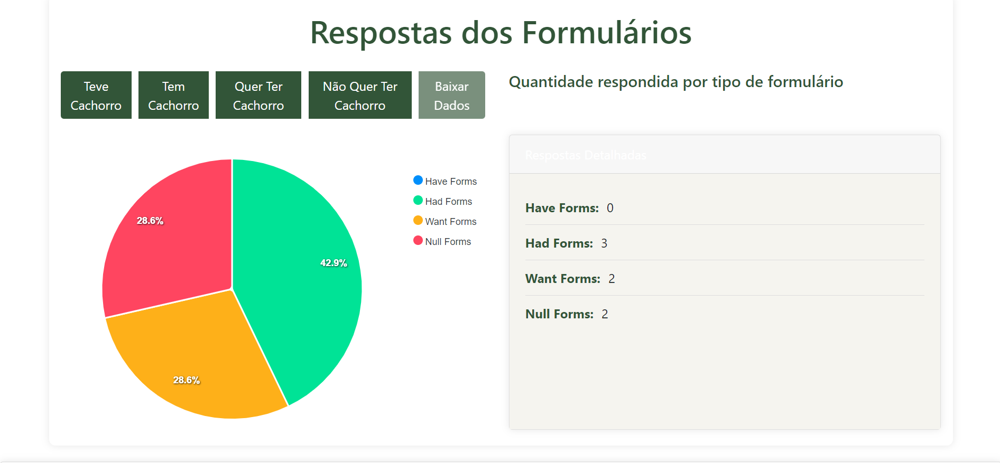&nbsp;
<br>
<sup>Fonte: Material produzido pelos autores (2024)</sup>
</div>

### Dificuldades e Próximos Passos

#### Dificuldades:

- **Estilização das Páginas:** 
  - A estilização das páginas tem sido um desafio, principalmente para garantir que todas as telas estejam visualmente consistentes e atendam aos padrões de usabilidade.
  - Também foram enfrentadas dificuldades em garantir a responsividade da aplicação para diferentes dispositivos.

- **Integração Completa:**
  - Maior dificuldade foi fazer a integração com o banco de dados na parte do administrador.

&nbsp;&nbsp;&nbsp;&nbsp;&nbsp;&nbsp;O desenvolvimento da terceira versão da aplicação web do projeto Abandono Zero foi um marco importante, uma vez que que foi o resultado de um crescimento do conhecimento técnico da equipe. Impactando de maneira positiva a nossa perspectiva futura em relação ao objetivo final da solução. 

# <a name="c5"></a>5. Testes

## 5.1. Relatório de testes automatizados 

## Introdução
&nbsp;&nbsp;&nbsp;&nbsp;&nbsp;&nbsp;Testes automatizados são uma prática crucial no desenvolvimento de software, usados para validar a funcionalidade e estabilidade de aplicações através de ferramentas que executam testes de forma autônoma, garantindo precisão e eficiência. Esses testes abrangem desde testes unitários, que isolam e verificam partes específicas do código, até testes de aceitação, que avaliam o sistema completo sob condições similares às de produção. A implementação de testes automatizados não apenas ajuda a identificar erros precocemente no ciclo de desenvolvimento, mas também melhora a cobertura de testes, reduz os custos associados a testes manuais repetitivos, e acelera o tempo de lançamento de produtos de software, garantindo consistência nos resultados e aumentando a confiança na qualidade do software entregue.

## Resumo dos resultados

<div align="center">
<sub>Quadro 04 - Resultados obtidos nos testes </sub>
</div>
<br>

| Controlador                       | Número de Testes | Testes Passaram | Testes Falharam |
|-----------------------------------|------------------|-----------------|-----------------|
| create all-dog                    | 2         | 2        | 0        |
| create dog-forms-have                     | 2         | 2           | 0   |   
| create dog-forms-want                     | 2        | 2        | 0        |
| create general-forms                     | 5         | 5        | 0        |
| create had-forms                     | 2         | 2        | 0        |
| create have-forms                     | 2         | 2        | 0        |
| create null-forms                     | 3         | 3        | 0        |
| create user-forms                     | 2         | 2        | 0        |
| create want-forms                     | 2         | 2        | 0        |
| **Total**                         | 22   | 22  | 0  |

<div align="center">
<sup>Fonte: Material produzido pelos autores (2024)</sup>
</div>


## Detalhes dos Testes:

### 1. CreateAllDogsFormsController
&nbsp;&nbsp;&nbsp;&nbsp;&nbsp;&nbsp;**Objetivo dos Testes:** Assegurar que o controlador processa corretamente a criação de formulários relacionados a cães, capturando informações detalhadas como nome, gênero, raça, idade e outros detalhes relevantes, e que ele responde apropriadamente em situações de sucesso e falha.

##### Testes Implementados: 
1. **Nome do Teste: Deve criar um novo formulário com sucesso**
   - **Descrição:** Este teste verifica se o controlador é capaz de criar um formulário de maneira bem-sucedida quando são fornecidos dados completos e válidos. O objetivo é confirmar que todos os dados são processados corretamente e armazenados no modelo `all_dogs_forms`.
   - **Entrada:** Dados completos do formulário, incluindo nome do cão, gênero, raça, idade, constituição familiar e identificação do proprietário.
   - **Esperado:** A função `create` dos helpers é chamada com os dados corretos, e a saída `success` é ativada, retornando o objeto do formulário criado.

2. **Nome do Teste: Deve retornar um erro se a criação do formulário falhar**
   - **Descrição:** Este teste avalia a capacidade do controlador de lidar com erros durante o processo de criação do formulário. É essencial que o sistema possa manejar falhas, como problemas de validação ou falhas na base de dados, de forma adequada.
   - **Entrada:** Os mesmos dados válidos usados no teste de sucesso.
   - **Esperado:** Apesar dos dados serem válidos, a função `create` é simulada para falhar, resultando na ativação da saída `error` com uma mensagem de erro explicativa.


### 2. CreateDogHaveFormsController
&nbsp;&nbsp;&nbsp;&nbsp;&nbsp;&nbsp;**Objetivo dos Testes:** Verificar a funcionalidade do controlador responsável por criar formulários de posse de cães, assegurando que os dados são corretamente processados e que as respostas adequadas são geradas em casos de sucesso e erro.

#### Testes Implementados:

1. **Nome do Teste: Deve criar um novo formulário com sucesso**
   - **Descrição:** Testa se o controlador cria um formulário com sucesso quando dados válidos são fornecidos.
   - **Entrada:** Dados válidos para a criação do formulário, incluindo informações de gênero, castração, posse e proprietário.
   - **Esperado:** A função `create` dos helpers é chamada com os dados corretos, e a saída `success` é disparada com o objeto do formulário.

2. **Nome do Teste: Deve retornar um erro se a criação do formulário falhar**
   - **Descrição:** Testa o comportamento do controlador quando há uma falha na criação do formulário, como por exemplo, um erro na comunicação com a base de dados ou dados inválidos.
   - **Entrada:** Dados válidos para a criação do formulário.
   - **Esperado:** A função `create` dos helpers é chamada, mas falha e rejeita a promessa, resultando no disparo da saída `error` com a mensagem de erro apropriada.


### 3. CreateDogWantFormsController
&nbsp;&nbsp;&nbsp;&nbsp;&nbsp;&nbsp;**Objetivo dos Testes:** Assegurar que o controlador manipula corretamente a criação de formulários de intenção de posse, processando e armazenando adequadamente os dados submetidos pelos usuários, e gerando as respostas apropriadas tanto em casos de sucesso quanto de falha.

#### Testes Implementados:

1. **Nome do Teste: Deve criar um novo formulário com sucesso**
   - **Descrição:** Este teste verifica a capacidade do controlador de criar um formulário com sucesso quando são fornecidos dados completos e válidos, refletindo a correta operação do sistema no registro das intenções de posse.
   - **Entrada:** Dados completos do formulário incluindo características desejadas do cão, convivência com o cão, apelido pretendido, e detalhes sobre a personalidade do cão desejado.
   - **Esperado:** A função `create` é chamada com os dados corretos e a saída `success` é ativada, retornando o objeto do formulário.

2. **Nome do Teste: Deve retornar um erro se a criação do formulário falhar**
   - **Descrição:** Este teste avalia a robustez do controlador ao enfrentar falhas durante a criação do formulário, como por exemplo erros de validação ou problemas técnicos como falhas no banco de dados.
   - **Entrada:** Os mesmos dados válidos do teste anterior.
   - **Esperado:** Apesar dos dados válidos, a função `create` é forçada a falhar, ativando a saída `error` com uma mensagem de erro explicativa.

### 4. CreateGeneralFormsController
&nbsp;&nbsp;&nbsp;&nbsp;&nbsp;&nbsp;**Objetivo dos Testes:** Validar a funcionalidade do controlador para criar formulários gerais, assegurando que os dados do formulário sejam corretamente processados e armazenados, e que respostas adequadas sejam geradas tanto em casos de sucesso quanto de falha.

#### Testes Implementados:

1. **Nome do Teste: Deve criar um novo formulário com sucesso**
   - **Descrição:** Este teste verifica se o controlador consegue criar um formulário com sucesso quando são fornecidos dados completos e válidos, refletindo o correto armazenamento dos dados no sistema.
   - **Entrada:** Dados completos de um formulário incluindo informações pessoais do usuário, tipo de moradia, constituição familiar, renda, endereço completo, e a escolha do formulário.
   - **Esperado:** A função `create` dos helpers é chamada com os dados corretos, e a saída `success` é ativada, retornando o objeto do formulário criado.

2. **Nome do Teste: Deve retornar um erro se a criação do formulário falhar**
   - **Descrição:** Este teste avalia a robustez do controlador ao lidar com falhas na criação do formulário, como erros de validação de dados ou problemas no banco de dados.
   - **Entrada:** Os mesmos dados válidos usados no teste anterior.
   - **Esperado:** Apesar dos dados válidos, a função `create` é forçada a falhar (simulado por um stub), resultando na ativação da saída `error` com uma mensagem de erro adequada.

### 5. CreateHadFormsController
&nbsp;&nbsp;&nbsp;&nbsp;&nbsp;&nbsp;**Objetivo dos Testes:** Testar a funcionalidade de criação de formulários de histórico de posse de animais no sistema, garantindo que todos os campos sejam adequadamente processados e que as respostas sejam corretas em cenários de sucesso e falha.

#### Testes Implementados:

1. **Nome do Teste: Deve criar um novo formulário com sucesso**
   - **Descrição:** Verifica se o controlador pode criar um formulário com sucesso quando dados válidos são fornecidos, cobrindo todos os aspectos do histórico de posse do animal, incluindo nome, características, custos, e informações veterinárias.
   - **Entrada:** Dados válidos incluindo informações detalhadas sobre o animal, como nome, personalidade, tempo com o dono, detalhes sobre outros pets, e informações veterinárias.
   - **Esperado:** A função `create` dos helpers é chamada com os dados corretos, resultando na saída `success` sendo disparada com o objeto do formulário fornecido.

2. **Nome do Teste: Deve retornar um erro se a criação do formulário falhar**
   - **Descrição:** Avalia a robustez do controlador ao lidar com falhas na criação do formulário, como problemas na base de dados ou falhas na validação de dados.
   - **Entrada:** Os mesmos dados válidos usados no teste de sucesso.
   - **Esperado:** A função `create` dos helpers é chamada, mas falha devido a um erro simulado, o que resulta na saída `error` sendo ativada com uma mensagem de erro apropriada.

### 6. CreateHaveFormsController
&nbsp;&nbsp;&nbsp;&nbsp;&nbsp;&nbsp;**Objetivo dos Testes:** Verificar a funcionalidade do controlador para criar formulários relacionados à posse de cães, garantindo que todos os campos sejam adequadamente processados e que respostas corretas sejam geradas em casos de sucesso e de falha.

#### Testes Implementados:

1. **Nome do Teste: Deve criar um novo formulário com sucesso**
   - **Descrição:** Este teste verifica se o controlador consegue criar um formulário com sucesso quando dados completos e válidos são fornecidos. O objetivo é assegurar que o formulário é salvo corretamente com todos os detalhes sobre a experiência de posse do usuário.
   - **Entrada:** Dados completos do formulário incluindo tempo com o cão, se é o primeiro cão, outros pets, idade do cão, raça, onde o cão foi adquirido, personalidade do cão, e razões para a posse.
   - **Esperado:** A função `create` dos helpers é chamada com os dados corretos, e a saída `success` é ativada, retornando o objeto do formulário.

2. **Nome do Teste: Deve retornar um erro se a criação do formulário falhar**
   - **Descrição:** Este teste avalia a robustez do controlador ao lidar com falhas durante a criação do formulário, como problemas na base de dados ou erros de validação dos dados fornecidos.
   - **Entrada:** Os mesmos dados válidos usados no teste de sucesso.
   - **Esperado:** A função `create` é chamada, mas falha devido a um erro simulado, resultando na ativação da saída `error` com uma mensagem de erro apropriada.

### 7. CreateNullFormsController
&nbsp;&nbsp;&nbsp;&nbsp;&nbsp;&nbsp;**Objetivo dos Testes:** Avaliar a eficácia do controlador em criar formulários que capturam as razões pelas quais os usuários podem rejeitar uma opção, garantindo que os dados sejam processados corretamente e que as respostas apropriadas sejam geradas para situações de sucesso e falha, incluindo falhas de validação.

#### Testes Implementados:

1. **Nome do Teste: Deve criar um novo formulário com sucesso**
   - **Descrição:** Este teste verifica se o controlador é capaz de criar um formulário de forma bem-sucedida quando dados válidos são fornecidos, assegurando que a criação ocorra sem erros e que a resposta de sucesso contenha o objeto do formulário.
   - **Entrada:** Dados completos e válidos para o formulário, incluindo informações sobre a aversão do usuário.
   - **Esperado:** A função `create` é chamada com os dados corretos, e a saída `success` é ativada, retornando o objeto do formulário.

2. **Nome do Teste: Deve retornar um erro se a criação do formulário falhar**
   - **Descrição:** Este teste avalia a capacidade do controlador de manejar falhas durante a criação do formulário, tais como erros na base de dados ou outros problemas técnicos.
   - **Entrada:** Dados válidos para a criação do formulário.
   - **Esperado:** A função `create` é chamada, mas um erro é simulado, resultando na ativação da saída `error` com uma mensagem de erro correspondente.

3. **Nome do Teste: Deve retornar um erro inválido se a criação do formulário falhar com 'invalid'**
   - **Descrição:** Testa a resposta do controlador a falhas de validação, verificando se respostas específicas são dadas para erros classificados como 'invalid'.
   - **Entrada:** Dados válidos que são manipulados para falhar especificamente com um erro de validação.
   - **Esperado:** Apesar dos dados serem processados, um erro de validação é simulado e a saída `invalid` é ativada com uma mensagem de erro apropriada, enquanto a saída de erro geral não é ativada.


  ### 8. CreateUserFormsController
&nbsp;&nbsp;&nbsp;&nbsp;&nbsp;&nbsp;**Objetivo dos Testes:** Avaliar a eficácia do controlador em processar e armazenar corretamente informações de usuários submetidas através de formulários, garantindo que os dados sejam registrados corretamente no sistema e que respostas apropriadas sejam geradas tanto em casos de sucesso quanto de falha.

##### Testes Implementados:

1. **Nome do Teste: Deve criar um novo formulário com sucesso**
   - **Descrição:** Este teste verifica a capacidade do controlador de criar um formulário de usuário com sucesso quando são fornecidos dados completos e válidos. O teste assegura que o sistema processa corretamente esses dados e os armazena no modelo apropriado.
   - **Entrada:** Dados completos de um formulário de usuário, incluindo nome social, celular, primeiro nome, último nome e identificação do usuário.
   - **Esperado:** A função `create` dos helpers é chamada com os dados corretos, a saída `success` é ativada, e o objeto do formulário é retornado.

2. **Nome do Teste: Deve retornar um erro se a criação do formulário falhar**
   - **Descrição:** Este teste avalia a robustez do controlador ao enfrentar falhas durante a criação do formulário, tais como problemas de validação ou falhas técnicas, como um erro de banco de dados.
   - **Entrada:** Os mesmos dados válidos usados no teste anterior.
   - **Esperado:** A função `create` é chamada, mas um erro é forçadamente introduzido, ativando a saída `error` com uma mensagem de erro explicativa.

### 9. CreateUserFormsController
&nbsp;&nbsp;&nbsp;&nbsp;&nbsp;&nbsp;**Objetivo dos Testes:** Avaliar a eficácia do controlador em processar e armazenar corretamente informações de usuários submetidas através de formulários, garantindo que os dados sejam registrados corretamente no sistema e que respostas apropriadas sejam geradas tanto em casos de sucesso quanto de falha.

##### Testes Implementados:

1. **Nome do Teste: Deve criar um novo formulário com sucesso**
   - **Descrição:** Este teste verifica a capacidade do controlador de criar um formulário de usuário com sucesso quando são fornecidos dados completos e válidos. O teste assegura que o sistema processa corretamente esses dados e os armazena no modelo apropriado.
   - **Entrada:** Dados completos de um formulário de usuário, incluindo nome social, celular, primeiro nome, último nome e identificação do usuário.
   - **Esperado:** A função `create` dos helpers é chamada com os dados corretos, a saída `success` é ativada, e o objeto do formulário é retornado.

2. **Nome do Teste: Deve retornar um erro se a criação do formulário falhar**
   - **Descrição:** Este teste avalia a robustez do controlador ao enfrentar falhas durante a criação do formulário, tais como problemas de validação ou falhas técnicas, como um erro de banco de dados.
   - **Entrada:** Os mesmos dados válidos usados no teste anterior.
   - **Esperado:** A função `create` é chamada, mas um erro é forçadamente introduzido, ativando a saída `error` com uma mensagem de erro explicativa.

  
## Cobertura dos testes:
<div align="center">
<sub>Figura 62 - Imagem Cobertura de testes</sub>
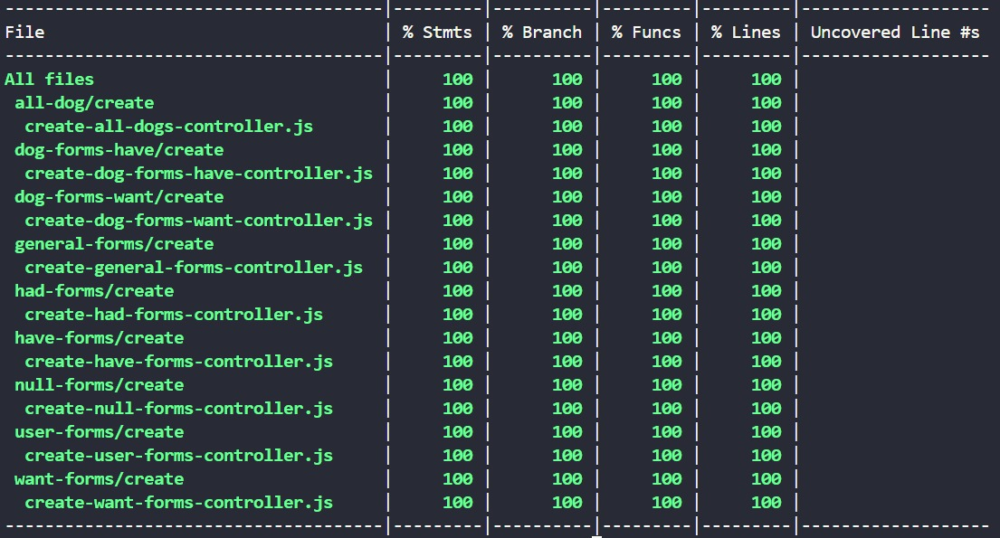
<sup>Fonte: Material produzido pelos próprios autores</sup>
</div>


 &nbsp;&nbsp;&nbsp;&nbsp;&nbsp;&nbsp;Cada linha lista um controlador específico com as respectivas métricas de cobertura: percentual de declarações executadas (% Stmts), percentual de ramificações avaliadas (% Branch), percentual de funções testadas (% Funcs) e percentual de linhas de código cobertas (% Lines). As colunas adicionais destacam as linhas de código que não foram cobertas pelos testes, ajudando a identificar áreas potenciais de risco onde o código pode não estar suficientemente validado contra falhas ou erros. Essas informações são cruciais para direcionar esforços futuros na melhoria dos testes, garantindo uma cobertura mais ampla e um software mais robusto e confiável.

#### Comandos para Executar os Testes:

&nbsp;&nbsp;&nbsp;&nbsp;&nbsp;&nbsp;No contexto do desenvolvimento de software utilizando Node.js, os comandos `npm run test` e `npm run cobertura` são fundamentais para a execução de testes automatizados e análise de cobertura de testes, respectivamente. Configurados no arquivo package.json sob a seção scripts, o comando `npm run test` geralmente inicia todos os testes definidos no projeto, que podem incluir testes unitários e de integração, executando-os através de uma ferramenta específica como Mocha ou Jest. Por outro lado, o comando `npm run cobertura` é usado para gerar relatórios de cobertura de testes, mostrando quais partes do código estão sendo efetivamente testadas. Este comando geralmente envolve a utilização de uma ferramenta como o nyc para coletar dados de cobertura enquanto os testes são executados, oferecendo insights valiosos sobre a eficácia dos testes e identificando áreas do código que podem necessitar de mais atenção em termos de testes.

## 5.2. Testes de usabilidade 
&nbsp;&nbsp;&nbsp;&nbsp;&nbsp;&nbsp;Um teste de usabilidade avalia quão fácil e eficaz é o uso de um produto, sistema ou serviço ao observar usuários reais completando tarefas específicas. O objetivo é identificar problemas e melhorar a experiência do usuário. Esses testes podem ser divididos em qualitativos e quantitativos.

&nbsp;&nbsp;&nbsp;&nbsp;&nbsp;&nbsp;Os testes qualitativos focam em entender por que os usuários enfrentam dificuldades, usando métodos como observação e entrevistas para coletar dados descritivos. Eles geralmente envolvem poucos participantes e são úteis nas fases iniciais do desenvolvimento para guiar o design.

&nbsp;&nbsp;&nbsp;&nbsp;&nbsp;&nbsp;Já os testes quantitativos medem o desempenho do usuário com métricas numéricas, como tempo de tarefa e taxa de sucesso, utilizando ferramentas automáticas e questionários. Estes testes requerem mais participantes e são usados nas fases finais para validar as decisões de design com dados estatísticos.


### 5.2.1 Registros de testes e melhorias

&nbsp;&nbsp;&nbsp;&nbsp;&nbsp;&nbsp;Realizamos testes quantitativos já que necessitamos entender o comportamento do usuário em relação a nosso site e seu design, para podermos realizar correções e deixá-lo o mais agradável possível. O qual pode ser acessado através deste [link](https://docs.google.com/spreadsheets/d/1fq3GHypiFq84BWnznHhRP0oHVLVof-V6Im-rZAX3QfQ/edit?usp=sharing).

# <a name="c6"></a>6. Conclusões e trabalhos futuros 
&nbsp;&nbsp;&nbsp;&nbsp;&nbsp;&nbsp;Após a conclusão do desenvolvimento do MVP, podemos afirmar que alcançamos nossos objetivos de maneira bem-sucedida. Entre esses marcos alcançados, merecem destaque o desenvolvimento do banco de dados integrado com o site, responsividade para grande parte dos dispositivos móveis e um sistema de login de alta segurança. Essas conquistas refletem nosso compromisso em oferecer uma experiência única ao usuário, alinhada com nossa missão de mapear os critérios que influenciam as decisões de adoção, compra ou abandono de cães, oferecendo uma visão abrangente e dinâmica do comportamento humano.

&nbsp;&nbsp;&nbsp;&nbsp;&nbsp;&nbsp;Apesar do sucesso alcançado até o momento, reconhecemos que ainda há espaço para desenvolvimentos significativos no futuro. Nesse contexto, é importante destacar alguns pontos de aprimoramento essenciais.

&nbsp;&nbsp;&nbsp;&nbsp;&nbsp;&nbsp;Primeiramente, é necessário subir o site para a produção, ou seja, garantir que o Abandono Zero esteja totalmente funcional e disponível online para utilização pelos usuários e dos cientistas.

&nbsp;&nbsp;&nbsp;&nbsp;&nbsp;&nbsp;Além disso, o dashboard é um dos pontos que queremos melhorar no futuro, pois ele ainda não está 100% integrado ao banco de dados. Essa integração completa é crucial para o sucesso do projeto, permitindo o desenvolvimento de mais gráficos e visualizações dos dados, de forma a extrair mais conclusões. Ademais, a implementação de mais gráficos facilitaria a visualização dos dados tornando mais fácil de tirar conclusões.

&nbsp;&nbsp;&nbsp;&nbsp;&nbsp;&nbsp;Também é importante considerar que o site tem o objetivo de atingir uma escala global, sendo necessário transformar a plataforma em um sistema de big data. Essa transição é crucial para que a plataforma consiga suportar e processar o volume massivo de dados que será coletado de diversos usuários ao redor do mundo.
 
&nbsp;&nbsp;&nbsp;&nbsp;&nbsp;&nbsp;Por fim, é essencial estabelecer parcerias estratégicas e adotar práticas de gestão de projetos eficazes para assegurar a evolução contínua e sustentável da plataforma. Dessa forma, conseguiremos não apenas manter o sucesso alcançado, mas também ampliar significativamente o impacto e a abrangência do projeto.


# <a name="c7"></a>7. Referências 

<p id="INSPA"></p>
COMPORTAMENTO animal com ênfase em cães e gatos. [S. l.], 2024. Disponível em: <a href = "https://psicologiaanimal.com.br/comportamento-animal-com-enfase-em-caes-e-gatos/">INSPA</a>. Acesso em: 15 abr. 2024.</p>


<p id="SWOT"></p>
<p>APRENDA o que é análise SWOT, ou análise FOFA, e saiba como fazer uma análise estratégica do seu negócio. In: Aprenda o que é análise SWOT, ou análise FOFA, e saiba como fazer uma análise estratégica do seu negócio. [S. l.]: Camila Casarotto, 20 dez. 2019. Disponível em: <a href = "https://rockcontent.com/br/blog/como-fazer-uma-analise-swot/" >rockcontent</a>. Acesso em: 17 abr. 2024.</p>

<p id="Porter"></p>
CASAROTTO, Camila. [S. l.], 11 dez. 2020. Disponível em: <a href="https://rockcontent.com/br/blog/5-forcas-de-porter/">5 Forças de Porter </a>. Acesso em: 17 abr. 2024.</p>

<p id="Canvas"></p>
PEREIRA, Daniel. Canvas da Proposta de Valor. In: PEREIRA, Daniel. Canvas da Proposta de Valor. [S. l.], 5 mar. 2019. Disponível em: <a href="https://analistamodelosdenegocios.com.br/canvas-da-proposta-de-valor/">CanvasDeValor</a>. Acesso em: 18 abr. 2024.

<p id="Persona"><p>
PEÇANHA, Vitor. Descubra o que é buyer persona e passo a passo para criar as suas. In: PEÇANHA, Vitor. Descubra o que é buyer persona e passo a passo para criar as suas. [S. l.], 4 jun. 2020. Disponível em: <a href="https://rockcontent.com/br/blog/personas/">rockcontent</a>. Acesso em: 18 abr. 2024.   


<p id="Wireframe"></p>
WIREFRAMES: O Que São e Como Criar O Seu (+ 10 Exemplos). In: Wireframes: O Que São e Como Criar O Seu (+ 10 Exemplos). [S. l.], 2020. Disponível em: <a href = "https://neilpatel.com/br/blog/wireframes-o-que-sao/">Wireframe</a>. Acesso em: 17 abr. 2024.
‌

‌
# <a name="c8"></a>Anexos

### Documento fornecido pelo Instituto de Pscologia Animal(INSPA) essenciais para a idealização e desenvolvimento dos formulários digitais:

- #### Questionários bases:

  - https://drive.google.com/drive/folders/1mWRyvxGjkb4qR6Mq7L7aMhxEGNZ1Q99g?usp=sharing

- #### Apresentação geral acerca do propósito que o INSPA estabeleceu na sociedade:

  - https://drive.google.com/drive/folders/1Onyqu2bpB6OPhwIUARDMjwSjUYud-uJ_?usp=sharing

